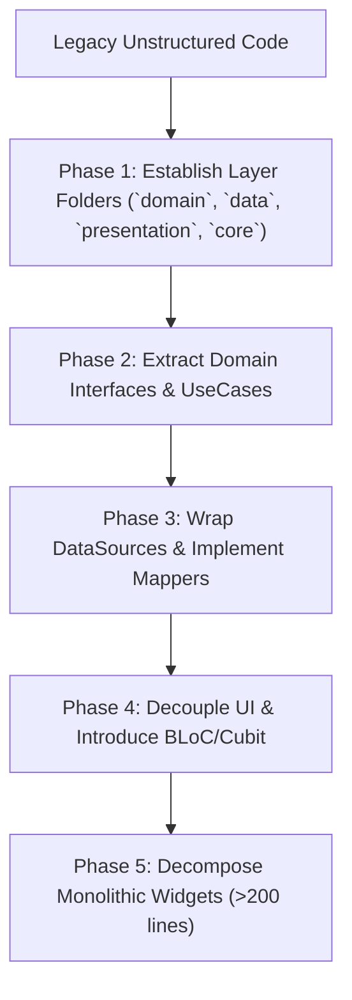

# Existing Architecture Aligner & Layer Decoupler

## 1. Purpose & Strategy

When modernizing an existing codebase, full rewrites are risky and error-prone.

This skill provides an **incremental, safe refactoring path** to align legacy or unstructured code with strict Clean Architecture boundaries without breaking working business features.

---

## 2. Refactoring Phases & Boundaries



---

## 3. Incremental Refactoring Rules

### Rule 1: Scaffolding Missing Layer Directories
Ensure the standard directory structure is established:
```
lib/
├── core/
│   ├── config/
│   ├── di/
│   ├── errors/
│   └── network/
├── data/
│   ├── datasources/
│   ├── models/
│   └── repositories/
├── domain/
│   ├── entities/
│   ├── failures/
│   ├── repositories/
│   └── usecases/
└── presentation/
    ├── pages/
    ├── state_management/
    ├── ui_kit/
    └── ui_utils/
```

### Rule 2: Decoupling Direct API/Database Calls from UI
- Identify UI widgets directly executing `Dio.get()`, `http.post()`, or direct DB queries.
- Extract these into DataSources in `lib/data/datasources/`.
- Create a Domain Repository interface in `lib/domain/repositories/` returning typed Entities and `Result`/`Either`.
- Create single-responsibility UseCases (e.g. `FetchItemsUseCase`, `SubmitFormUseCase`) in `lib/domain/usecases/`.
- Connect BLoC/Cubit exclusively to UseCases.

### Rule 3: Widget Decomposition (>200 Lines Constraint)
- Identify screen files exceeding 150–200 lines.
- Extract private helper methods (e.g. `Widget _buildHeader()`, `Widget _buildList()`) into dedicated `StatelessWidget` classes inside `lib/presentation/pages/<feature>/widgets/`.
- Preserve layout integrity while optimizing render tree rebuild performance.

### Rule 4: Dependency Injection via `injectable`
- Register all data sources, repositories, use cases, and BLoCs using `@lazySingleton`, `@injectable`, and `@factoryMethod`.
- Scaffold `lib/core/di/injection.dart` using `GetIt` and `injectable`.

---

## 4. Verification

Run static analysis to confirm that UI files do not import data or infrastructure layers:

```bash
dart analyze
```
