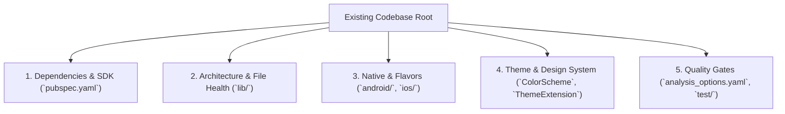

# Existing Codebase Analyzer & Auditor

## 1. Purpose & Scope

This skill performs a non-destructive, thorough audit of an existing Flutter codebase to assess its architecture maturity, technical debt, and readiness for standard template alignment.

It produces a structured markdown report `ADOPTION_AUDIT_REPORT.md` used to guide the interactive Grill-Me interview in [project-adoption-hub](../project-adoption-hub/SKILL.md).

---

## 2. Audit Vectors & Inspection Checklist



### Vector 1: Dependencies & SDK Audit
- **SDK Range:** Inspect `environment.sdk` and `flutter` version.
- **State Management:** Detect `flutter_bloc`, `bloc`, `provider`, `riverpod`, `mobx`, `get_it`, `hydrated_bloc`.
- **Networking & Serialization:** Detect `dio`, `http`, `retrofit`, `json_serializable`, `freezed`.
- **Routing:** Detect `auto_route`, `go_router`, `beamer`, or raw `Navigator 2.0`.
- **Storage:** Detect `shared_preferences`, `flutter_secure_storage`, `hive`, `isar`, `realm`, `sqflite`.
- **Uncategorized/Custom Libraries:** Identify non-standard packages that require dedicated custom skills (e.g. `supabase_flutter`, `firebase_*`, `camera`, `flutter_map`, `graphql_flutter`).

### Vector 2: Architecture & File Decomposition
- Check if code is organized into `domain/`, `data/`, `presentation/`, `core/` (or monolithic/feature-by-layer).
- Search for files exceeding the 150–200 lines limit:
  - Identify monolithic screen files.
  - Identify private widget builder methods (e.g. `Widget _buildHeader()`) inside widget classes instead of separate `StatelessWidget` classes.
- Check if UI widgets directly instantiate or invoke Repositories/DataSources instead of UseCases & BLoCs.

### Vector 3: Native Configurations & Flavors Presence
- **Android:** Check `android/app/build.gradle` for `flavorDimensions` and `productFlavors` (`dev`, `stage`, `prod`).
- **iOS:** Check `ios/Runner.xcodeproj/project.pbxproj` and `ios/Runner/` for Schemes and xcconfig configurations.
- **Dart Environment:** Check for `config/env_*.json` and centralized `AppConfig`.

### Vector 4: Theme & Design System Audit
- Check for hardcoded `Color(0x...)` or static color classes in UI widgets.
- Verify Material 3 activation (`useMaterial3: true`).
- Check for `ThemeExtension` implementations (e.g. `AppCustomColors`).
- Check if an interactive `UiKitPage` component showcase exists.

### Vector 5: Quality & Testing Gates
- Inspect `analysis_options.yaml` for strict lint rules (`prefer_const_constructors`, `avoid_flutter_imports`, etc.).
- Inspect `test/` and `integration_test/` directories for test coverage.

---

## 3. Audit Output Format: `ADOPTION_AUDIT_REPORT.md`

Generate a report formatted as follows:

```markdown
# Adoption Audit Report: [Project Name]

## 1. Executive Summary
- **Current SDK:** Flutter [version] / Dart [version]
- **Architecture Maturity:** [Tier: Low / Medium / High]
- **Flavors Configured:** [Yes / Partial / None]
- **Material 3 & ThemeExtension:** [Compliant / Hardcoded]

## 2. Dependencies Matrix & Custom Package Detection
- **Standard Template Packages:** [Matched list]
- **Custom / Project-Specific Packages:** [List requiring skill-creator synthesis]
- **Outdated / Deprecated Packages:** [List]

## 3. Architecture & File Health Findings
- **Clean Architecture Boundaries:** [Status & gaps]
- **Files Exceeding 200 Lines:** [Count & list of top violators]
- **UI Decoupling Status:** [BLoC / Direct calls detected]

## 4. Recommended Migration Steps
1. [Step 1: e.g. Synthesize skills for Supabase]
2. [Step 2: e.g. Introduce Flavors and AppConfig]
3. [Step 3: e.g. Extract UI Kit and Material 3 theme]
```

---

## 4. Integration with Project Adoption Hub

Once generated, provide the audit summary to [project-adoption-hub](../project-adoption-hub/SKILL.md) to drive the interactive `grill-me` interview.
