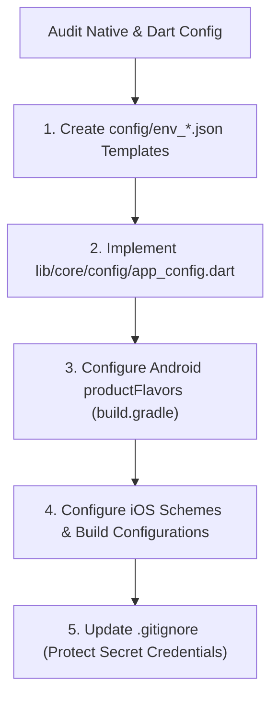

# Existing Project Flavors Migrator

## 1. Purpose & Scope

Many legacy or existing Flutter projects operate on a single configuration without environment segregation.

This skill safely introduces a multi-flavor architecture (`dev`, `stage`, `prod`) using standard Dart compile-time defines (`--dart-define-from-file`), centralized `AppConfig`, and native platform flavor support.

---

## 2. Migration Workflow



---

## 3. Step-by-Step Migration Implementation

### Step 1: Create Environment JSON Configurations
Create the standard configuration files in `config/`:

```json
// config/env_dev.json
{
  "APP_ENV": "dev",
  "APP_NAME": "App Dev",
  "BASE_URL": "https://api-dev.example.com",
  "ENABLE_LOGGING": true
}
```

Create `config/env_stage.json`, `config/env_prod.json`, and `config/env_template.json`.

> [!CAUTION]
> Add `config/env_*.json` to `.gitignore` and ensure only `config/env_template.json` is tracked in git.

---

### Step 2: Create Centralized `AppConfig`
Scaffold `lib/core/config/app_config.dart`:

```dart
enum EnvironmentType { dev, stage, prod }

abstract final class AppConfig {
  static const String appEnv = String.fromEnvironment('APP_ENV', defaultValue: 'dev');
  static const String appName = String.fromEnvironment('APP_NAME', defaultValue: 'App');
  static const String baseUrl = String.fromEnvironment('BASE_URL', defaultValue: '');
  static const bool enableLogging = bool.fromEnvironment('ENABLE_LOGGING', defaultValue: false);

  static EnvironmentType get environment {
    return switch (appEnv.toLowerCase()) {
      'stage' || 'staging' => EnvironmentType.stage,
      'prod' || 'production' => EnvironmentType.prod,
      _ => EnvironmentType.dev,
    };
  }

  static bool get isDev => environment == EnvironmentType.dev;
  static bool get isProd => environment == EnvironmentType.prod;
}
```

---

### Step 3: Configure Android `productFlavors`
In `android/app/build.gradle`:

```groovy
android {
    ...
    flavorDimensions "default"

    productFlavors {
        dev {
            dimension "default"
            applicationIdSuffix ".dev"
            resValue "string", "app_name", "App Dev"
        }
        stage {
            dimension "default"
            applicationIdSuffix ".stage"
            resValue "string", "app_name", "App Stage"
        }
        prod {
            dimension "default"
            resValue "string", "app_name", "App"
        }
    }
}
```

---

### Step 4: Configure iOS Schemes
Reference [native-flavors-environments](../../native/native-flavors-environments/SKILL.md) and [native-ios](../../native/native-ios/SKILL.md) to set up corresponding Xcode Schemes (`Runner-dev`, `Runner-stage`, `Runner-prod`) and Bundle Identifier suffixes (`.dev`, `.stage`).

---

## 4. Verification & Run Commands

Verify that the migrated project launches with each flavor:

```bash
# Run Dev
flutter run --flavor dev --dart-define-from-file=config/env_dev.json

# Run Stage
flutter run --flavor stage --dart-define-from-file=config/env_stage.json

# Run Prod
flutter run --flavor prod --dart-define-from-file=config/env_prod.json
```
