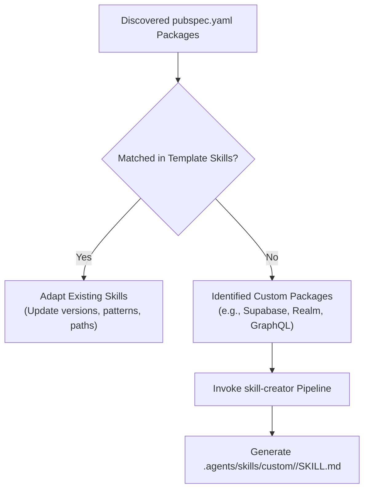

# Dynamic Skill Synthesizer & Adapter

## 1. Purpose & Strategy

When onboarding an existing Flutter project, the codebase may rely on libraries and architectural patterns outside the default template (e.g. Supabase instead of Retrofit/REST, Hive instead of HydratedStorage, Riverpod instead of BLoC, GraphQL, Camera, Google Maps).

This skill dynamically **synthesizes dedicated agent skills** using [skill-creator](../../skill-creator/SKILL.md) and **adapts existing template skills** so AI agents can maintain and extend the project without violating project-specific conventions.

---

## 2. Package-to-Skill Discovery & Mapping Engine



### Common Package Categories Requiring Skill Synthesis:

| Category | Example Libraries | Synthesized Skill Name & Purpose |
| :--- | :--- | :--- |
| **BaaS / Backend** | `supabase_flutter`, `appwrite`, `amplify_flutter` | `supabase-client-patterns` / `appwrite-integration` |
| **Local Databases** | `hive`, `hive_flutter`, `isar`, `realm`, `objectbox`, `drift` | `local-storage-<db>-patterns` |
| **Alternative State** | `flutter_riverpod`, `mobx`, `signals`, `get` | `state-management-<framework>` |
| **Alternative Routing**| `go_router`, `beamer`, `qlevar_router` | `navigation-<router>-patterns` |
| **Networking/APIs** | `graphql_flutter`, `ferry`, `grpc`, `web_socket_channel` | `api-<protocol>-patterns` |
| **Hardware / Media** | `camera`, `flutter_sound`, `audioplayers`, `google_maps_flutter`| `media-<feature>-patterns` |

---

## 3. Skill Synthesis Execution Protocol via `skill-creator`

For each identified custom package or architectural variation:

### Step 1: Create Destination Directory
Create a dedicated subfolder under `.agents/skills/` or a domain-specific category (e.g. `.agents/skills/integrations/<feature-name>/`).

### Step 2: Formulate Standard Frontmatter & Instructions
Follow strict [skill-creator](../../skill-creator/SKILL.md) formatting:
```yaml
---
name: <kebab-case-skill-name>
description: <Concise, actionable trigger description with exact library and use-case references>
---
```

### Step 3: Embed Project-Specific Production Patterns
Each synthesized skill MUST contain:
1. **Dependency Injection Setup:** How the library is registered via `@lazySingleton` or `@injectable`.
2. **Clean Architecture Placement:**
   - Client instances & DTOs in `data/datasources/` and `data/repositories/`.
   - Domain interfaces in `domain/repositories/`.
   - BLoC / UI consumers in `presentation/`.
3. **Error Handling & Failure Mapping:** Mapping library-specific exceptions to Domain `Failure` sealed classes.
4. **Concrete Abstracted Code Examples:** Working Dart code snippets without hardcoded domain values.

---

## 4. Adapting Existing Template Skills

When the target project has established architectural choices that differ from the template defaults:

1. **State Management Alignment:** If the project exclusively uses Cubits or Riverpod, adapt `state-management` guidelines to avoid enforcing event-driven BLoCs where unnecessary.
2. **Routing Alignment:** If the project uses `go_router`, link navigation patterns to GoRouter declarative config rather than AutoRoute.
3. **Storage Alignment:** If tokens/preferences use `flutter_secure_storage` directly without `hydrated_bloc`, document the existing abstraction layer.

---

## 5. Verification & Registration

After synthesizing new skills:
- Validate markdown links and YAML frontmatter.
- Verify that AI agent instructions reference the newly synthesized skills in the global hub or domain hubs.
