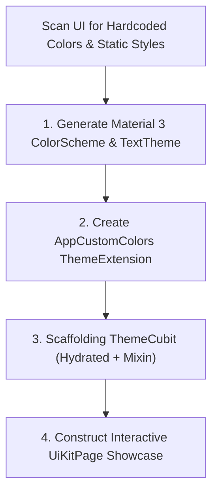

# Existing Theme & UI Kit Extractor

## 1. Purpose & Scope

Existing projects frequently suffer from hardcoded color literals (`Color(0xFF...)`), lack of dark mode support, and absence of a centralized UI Kit catalog.

This skill extracts color tokens into **Material 3 Dynamic ColorSchemes**, defines custom tokens via `ThemeExtension`, configures an injectable `ThemeCubit`, and creates an interactive `UiKitPage` component showcase.

---

## 2. Extraction & Migration Workflow



---

## 3. Step-by-Step Implementation

### Step 1: Material 3 ColorScheme Setup
Create `lib/presentation/ui_utils/theme/app_theme.dart`:

```dart
abstract final class AppTheme {
  static const Color primarySeed = Color(0xFFFFDE3F);

  static ThemeData get lightTheme {
    final colorScheme = ColorScheme.fromSeed(
      seedColor: primarySeed,
      brightness: Brightness.light,
    );

    return ThemeData(
      useMaterial3: true,
      colorScheme: colorScheme,
      extensions: const [
        AppCustomColors.light,
      ],
    );
  }

  static ThemeData get darkTheme {
    final colorScheme = ColorScheme.fromSeed(
      seedColor: primarySeed,
      brightness: Brightness.dark,
    );

    return ThemeData(
      useMaterial3: true,
      colorScheme: colorScheme,
      extensions: const [
        AppCustomColors.dark,
      ],
    );
  }
}
```

---

### Step 2: Custom Tokens via `ThemeExtension`
Scaffold `lib/presentation/ui_utils/theme/app_custom_colors.dart` to capture project-specific custom colors (e.g. status tags, trading badges, brand gradients) with distinct Light and Dark variants.

---

### Step 3: Injectable `ThemeCubit` with Hydrated Mixin
Scaffold `lib/presentation/state_management/theme/`:
- `theme_state.dart`
- `theme_cubit.dart`
- `hydrated_theme_cubit.mixin.dart` (Strictly separating `fromJson`/`toJson` per persistence standard).

---

### Step 4: Construct Interactive `UiKitPage` Showcase
Scaffold `lib/presentation/pages/uikit/uikit_page.dart` featuring an interactive Material Theme Builder-inspired visual component gallery:
- **Color Palette & Scheme Inspector:** Live visualization of `primary`, `secondary`, `surface`, and `customColors`.
- **Typography Matrix:** Full `TextTheme` scale (`displayLarge` down to `labelSmall`).
- **Button & Input Gallery:** Filled, Outlined, Text buttons, and reactive form inputs in all states (enabled, focused, disabled, error).
- **Cards, Badges & Dialogs:** All reusable UI Kit widgets rendered across Light and Dark themes with live mode toggling.

---

## 4. Verification

1. Verify theme changes in `MaterialApp.router`:
```dart
theme: AppTheme.lightTheme,
darkTheme: AppTheme.darkTheme,
themeMode: themeState.themeMode,
```
2. Navigate to `UiKitPage` in simulator/web to confirm zero hardcoded color dependencies.
