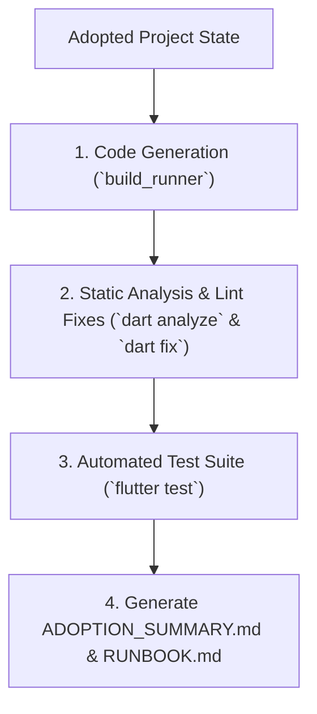

# Existing Project Verification & Runbook Compiler

## 1. Purpose & Scope

This skill performs the final quality assurance gate for project adoption. It executes code generators, runs static analysis, executes test suites, applies automatic lint fixes, and delivers a comprehensive adoption summary.

---

## 2. Verification Execution Workflow



---

## 3. Step-by-Step Verification Pipeline

### Step 1: Code Generation
Execute `build_runner` to generate DI, DTO, and Freezed files:

```bash
flutter pub run build_runner build --delete-conflicting-outputs
```

---

### Step 2: Static Analysis & Automatic Lint Fixes
Run static analysis against project `analysis_options.yaml`:

```bash
# 1. Inspect issues
dart analyze

# 2. Apply automatic mechanical fixes
dart fix --apply
```

---

### Step 3: Test Suite Execution
Execute automated unit and widget test suites:

```bash
flutter test
```

---

### Step 4: Compile Final `ADOPTION_SUMMARY.md`
Generate a comprehensive migration summary artifact:

```markdown
# Project Adoption Summary

## 1. Status & Health
- **Adoption Status:** Completed Successfully
- **Code Generation:** Pass
- **Static Analysis:** 0 Errors, 0 Warnings
- **Test Suite:** [X] Tests Passed

## 2. Changes & Migrations Summary
- **Flavors:** Configured (`dev`, `stage`, `prod`) with `config/env_*.json` and `AppConfig`.
- **Dynamic Skills Synthesized:** [List of new skills generated via skill-creator]
- **Architecture Layers:** Scaffolding aligned with Clean Architecture.
- **Theme & UI Kit:** Material 3 (#FFDE3F) + `AppCustomColors` + `UiKitPage` showcase.

## 3. Recommended Next Steps
- Run the application with `flutter run --flavor dev --dart-define-from-file=config/env_dev.json`.
- Review the interactive component showcase at `/uikit`.
```
