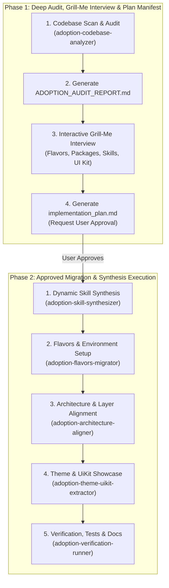

# Project Adoption & Onboarding Hub

## 1. Overview & Two-Phase Adoption Lifecycle

This skill provides a systematic, zero-risk onboarding workflow to audit and adapt **existing Flutter projects** to the production standard: Clean Architecture, multi-environment Flavors (`dev`, `stage`, `prod`), Material 3 design system, dynamic custom skills synthesis via `skill-creator`, and automated test suites.

To guarantee complete alignment and eliminate unwanted regressions, project adoption strictly follows a **Two-Phase Lifecycle**:

---

## 2. Phase 1: Deep Audit & Grill-Me Interview Protocol

When a user requests to adapt, onboard, or modernize an existing project (e.g. *"адаптуй цей проект"*, *"зроби аудит і підготуй міграцію"*, *"onboard existing project"*):

### Step 1: Execute Deep Audit
Invoke [adoption-codebase-analyzer](../adoption-codebase-analyzer/SKILL.md) to inspect:
- `pubspec.yaml` (SDK constraints, dependencies, state management libraries, networking, storage).
- Architecture structure (`lib/` layout, layer separation, monolithic files >200 lines).
- Native configurations (Android `build.gradle`, iOS Xcode schemes & configurations).
- Design system (hardcoded colors, Material 2 vs 3, presence of `ThemeExtension` or `UiKitPage`).
- Quality gates (linter rules in `analysis_options.yaml`, test coverage in `test/`).

### Step 2: Interactive Grill-Me Interview
Using the `ask_question` tool, ask targeted questions based on the audit findings:
1. **Flavors Integration:** If flavors are missing or incomplete, ask if the user wants to introduce `dev`, `stage`, and `prod` with `config/env_*.json`.
2. **Dependency Upgrades:** Ask whether to upgrade outdated dependencies to latest compatible versions.
3. **Custom Skill Synthesis:** If the project uses unique packages not in the template (e.g. `supabase_flutter`, `realm`, `isar`, `go_router`, `riverpod`, `graphql_flutter`), offer to synthesize dedicated skills via [skill-creator](../../skill-creator/SKILL.md).
4. **Architecture Refactoring Scope:** Ask whether to perform gradual layer wrapping (safe) or full Clean Architecture restructuring.
5. **UI Kit & Showcase:** Ask if the user wants an interactive `UiKitPage` created for the existing widget components.

### Step 3: Compile Implementation Plan Manifest
Generate a comprehensive `implementation_plan.md` artifact detailing:
- Audit summary and identified technical debt.
- Selected migration tasks and target files.
- List of new custom skills to synthesize.
- Risk mitigation strategy and backup advice.

> [!IMPORTANT]
> The agent sets `RequestFeedback: true` on `implementation_plan.md` and **STOPS to wait for explicit user approval** before executing any modifications.

---

## 3. Phase 2: Execution Sub-Skill Routing Matrix

Once the user approves the plan, execute the following sub-skills sequentially:

| Order | Sub-Skill | Role & Purpose |
| :---: | :--- | :--- |
| **1** | [adoption-skill-synthesizer](../adoption-skill-synthesizer/SKILL.md) | Synthesizes custom agent skills for project-specific libraries and adapts existing skills. |
| **2** | [adoption-flavors-migrator](../adoption-flavors-migrator/SKILL.md) | Configures multi-environment Flavors (`dev`, `stage`, `prod`), `config/env_*.json`, and `AppConfig`. |
| **3** | [adoption-architecture-aligner](../adoption-architecture-aligner/SKILL.md) | Establishes Clean Architecture boundaries, decouples UI from data sources, and refactors monolithic widgets. |
| **4** | [adoption-theme-uikit-extractor](../adoption-theme-uikit-extractor/SKILL.md) | Migrates hardcoded colors to Material 3 tokens, creates `ThemeExtension`, and builds `UiKitPage`. |
| **5** | [adoption-verification-runner](../adoption-verification-runner/SKILL.md) | Runs code generation, fixes lint errors (`dart fix`), executes tests, and produces `ADOPTION_SUMMARY.md`. |

---

## 4. Master Adoption Checklist

- [ ] `adoption-codebase-analyzer` executed and `ADOPTION_AUDIT_REPORT.md` produced.
- [ ] Interactive Grill-Me interview completed with user.
- [ ] `implementation_plan.md` generated with `RequestFeedback: true` and approved by user.
- [ ] Project-specific skills synthesized via `adoption-skill-synthesizer` and `skill-creator`.
- [ ] Multi-environment Flavors and `AppConfig` configured via `adoption-flavors-migrator`.
- [ ] Clean Architecture layer boundaries aligned via `adoption-architecture-aligner`.
- [ ] Material 3 theme and interactive `UiKitPage` verified via `adoption-theme-uikit-extractor`.
- [ ] `build_runner`, `dart analyze`, and `flutter test` pass 100% via `adoption-verification-runner`.
- [ ] Final `ADOPTION_SUMMARY.md` delivered to user.
