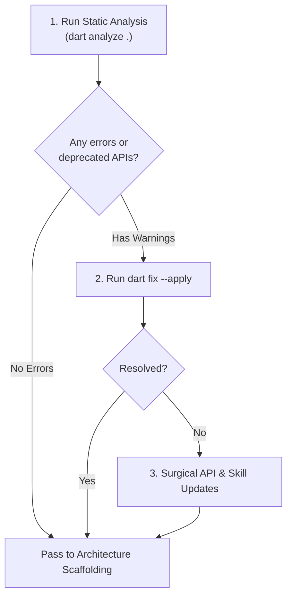

# Package Compatibility & Skill Signature Auditor

## 1. Overview & When to Apply

Use this skill following dependency synchronization or package upgrades:
- Identifying any breaking API changes, renamed classes, or deprecated parameters introduced by updated packages (e.g. major version bumps in `dio`, `auto_route`, `reactive_forms`, `freezed`, `hydrated_bloc`).
- Applying automated migrations via `dart fix --apply`.
- Verifying that code snippets and rules inside `.agents/skills/` reflect active library APIs.

---

## 2. Prerequisites & Related Skills

| Relation | Skill | Purpose |
| :--- | :--- | :--- |
| **Parent Hub** | [project-bootstrap-hub](../project-bootstrap-hub/SKILL.md) | Master bootstrapping coordinator. |
| **Previous Step** | [bootstrap-dependencies-sync](../bootstrap-dependencies-sync/SKILL.md) | Dependency installation and lockfile synchronization. |
| **Static Analysis** | [dart-run-static-analysis](../../dart-run-static-analysis/SKILL.md) | Running analyzer and applying mechanical fixes. |
| **Next Step** | [bootstrap-architecture-scaffold](../bootstrap-architecture-scaffold/SKILL.md) | Scaffolding folder structure and Flavors. |

---

## 3. Step-by-Step Compatibility Audit Workflow



### Step 1: Execute Full Project Analysis
```bash
dart analyze . --fatal-infos
```

### Step 2: Apply Automated Quick-Fixes
```bash
# Preview proposed fixes
dart fix --dry-run
# Apply fixes across all files
dart fix --apply
```

### Step 3: Check Known Critical Package Signatures

Review the following common package API evolutions if compiler errors persist:

1. **`auto_route`:**
   - Verify `@RoutePage()` annotations on screens.
   - Verify `AutoRouterConfig(replaceInRouteName: 'Page|Screen,Route')`.
   - Verify router instance setup with `appRouter.config()`.

2. **`reactive_forms`:**
   - Verify `ReactiveTextField`, `FormGroup`, `FormControl` generic types.
   - Verify `Validators.required`, `Validators.email`, `Validators.pattern`.

3. **`freezed` (per project rules):**
   - Freezed 3+ syntax: Regular class with `with _$ClassName` and `const ClassName({required this.field});`.
   - Ensure NO `map`, `when`, `fromJson`, or `toJson` generation is expected on Freezed models (use explicit Dart 3 `sealed class` pattern matching).

4. **`hydrated_bloc`:**
   - Verify `HydratedBloc.storage = await HydratedStorage.build(...)` initialization.
   - Ensure all serialization is encapsulated in `hydrated_<feature>_bloc.mixin.dart`.

5. **`dio` & `retrofit`:**
   - Verify `DioException` (not legacy `DioError`).
   - Verify `@RestApi()` client annotations and `@Body()`, `@Header()`, `@Query()`.

---

## 4. Skill Tree Synchronization Rule

If an upgraded package introduces a new recommended paradigm or deprecates an older syntax:
1. Locate the corresponding specialized skill in `.agents/skills/` (e.g. `presentation/navigation/flutter-auto-route-core`).
2. Update the code patterns and anti-patterns table in the skill to prevent the AI agent from generating obsolete signatures in future turns.

---

## 5. Verification Checklist

- [ ] `dart analyze .` passes with zero errors and zero warnings.
- [ ] Automated fixes applied via `dart fix --apply`.
- [ ] Known package breaking points verified.
- [ ] Skill guidelines synced with active library versions.
- [ ] Ready to proceed to [bootstrap-architecture-scaffold](../bootstrap-architecture-scaffold/SKILL.md).
