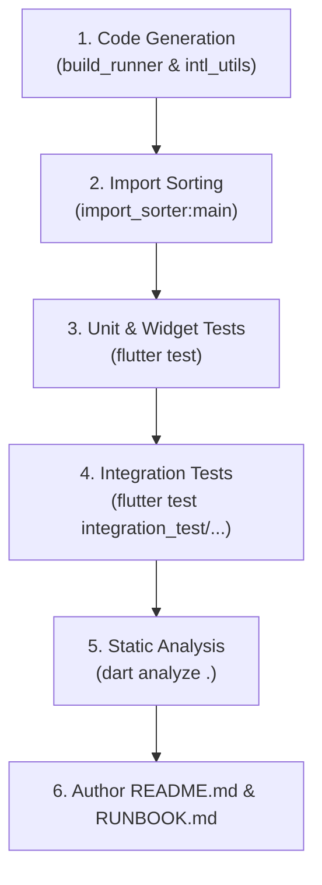

# Bootstrapping Verification & Documentation

## 1. Overview & When to Apply

Use this skill during the final phase of project bootstrapping:
- Running all code generation pipelines (`build_runner`, `intl_utils`).
- Executing unit and widget test suites via `flutter test`.
- Generating standard project documentation (`README.md` and `RUNBOOK.md`) covering environment setup, Flavor execution, code generation workflows, testing instructions, and `.agents/skills/` navigation.

---

## 2. Prerequisites & Related Skills

| Relation | Skill | Purpose |
| :--- | :--- | :--- |
| **Parent Hub** | [project-bootstrap-hub](../project-bootstrap-hub/SKILL.md) | Master bootstrapping coordinator. |
| **Build Runner** | [flutter-build-runner](../../flutter-build-runner/SKILL.md) | Code generation execution and cache management. |
| **Testing Hub** | [testing-hub](../../testing/testing-hub/SKILL.md) | Unit, BLoC, and widget testing standards. |
| **Flavors** | [native-flavors-environments](../../native/native-flavors-environments/SKILL.md) | Multi-environment CLI launch commands. |

---

## 3. Step-by-Step Verification Pipeline



### Step 1: Execute Code Generators
```bash
# Generate localization S classes
flutter pub run intl_utils:generate

# Generate Freezed, Retrofit, Injectable, and AutoRoute files
flutter pub run build_runner build --delete-conflicting-outputs
```

### Step 2: Sort Imports Workspace-Wide
```bash
flutter pub run import_sorter:main
```

### Step 3: Execute Automated Unit & Widget Tests
```bash
flutter test
```

### Step 4: Execute Integration Smoke Test
```bash
flutter test integration_test/uikit_page_test.dart
```

### Step 5: Run Static Analysis
```bash
dart analyze . --fatal-infos
```

---

## 4. Documentation Generation Standards

Create two central documentation files in the project root:

### 4.1 `README.md` (Project Overview & Getting Started)
Includes:
1. **Badges:** Flutter version, Dart SDK version, License.
2. **Project Description:** High-level architectural overview.
3. **Prerequisites:** Flutter SDK version, Dart version, CocoaPods (iOS), Java/JDK (Android).
4. **Environment Configuration:** How to duplicate `config/env_template.json` to `config/env_dev.json`.
5. **Quick Start Commands:**
   ```bash
   # Install dependencies
   flutter pub get

   # Run code generation
   flutter pub run build_runner build --delete-conflicting-outputs

   # Sort imports
   flutter pub run import_sorter:main

   # Run development flavor
   flutter run --flavor dev --dart-define-from-file=config/env_dev.json
   ```

### 4.2 `RUNBOOK.md` (Operations & Development Guide)
Includes:
1. **Flavors Execution Table:**
   | Environment | Run Command |
   | :--- | :--- |
   | **Development** | `flutter run --flavor dev --dart-define-from-file=config/env_dev.json` |
   | **Staging** | `flutter run --flavor stage --dart-define-from-file=config/env_stage.json` |
   | **Production** | `flutter run --flavor prod --dart-define-from-file=config/env_prod.json` |

2. **Code Generation & Quality Runbook:**
   - One-off build: `flutter pub run build_runner build --delete-conflicting-outputs`
   - Watch mode: `flutter pub run build_runner watch --delete-conflicting-outputs`
   - Cache clean: `flutter pub run build_runner clean && flutter pub get`
   - Import sorting: `flutter pub run import_sorter:main`

3. **Testing Runbook:**
   - Run all tests: `flutter test`
   - Run unit tests: `flutter test test/unit/`
   - Run widget tests: `flutter test test/widget/`
   - Run integration tests: `flutter test integration_test/uikit_page_test.dart`

4. **Clean Architecture Directory Map:**
   Reference map to `lib/` and clickable links to `.agents/skills/`.

---

## 5. Master Verification Checklist

- [ ] `intl_utils:generate` generated localization classes in `lib/l10n/generated/`.
- [ ] `build_runner` completed with zero conflicting output errors.
- [ ] `import_sorter:main` formatted all import statements workspace-wide.
- [ ] `flutter test` passed with 100% success rate.
- [ ] `integration_test/uikit_page_test.dart` verified UiKit rendering and interaction.
- [ ] `dart analyze .` returns 0 diagnostics.
- [ ] `README.md` and `RUNBOOK.md` generated at project root.
- [ ] Project bootstrapping complete and production-ready.
