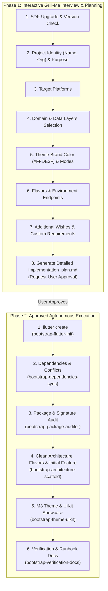

# Project Bootstrap & Scaffolding Coordinator

## 1. Overview & Two-Phase Lifecycle

This skill coordinates the end-to-end initialization and scaffolding of a brand new, production-ready Flutter application adhering strictly to Clean Architecture, Material 3, multi-environment Flavors, and full testability.

To prevent misconfigurations and ensure 100% alignment, the bootstrapping process operates in **two strict phases**:

---

## 2. Phase 1: Interactive Discovery Interview (`grill-me` Protocol)

When the user asks to create/bootstrap a new project (e.g. *"створи новий проект"*, *"bootstrap new flutter app"*, *"ініціалізуй проект з шаблону"*):

The agent **MUST NOT** immediately run modifying commands. Instead, the agent conducts a structured interview using the `ask_question` tool covering the following 7 discovery areas:

1. **Flutter SDK Upgrade:**
   - Check current Flutter SDK version and ask if the user wishes to upgrade to the latest `stable` channel.
2. **Project Identity & Domain Purpose (Optional):**
   - **Project Name:** Lowercase `snake_case` Dart identifier (e.g. `cinema_app`, `habit_tracker`).
   - **Organization Reverse-Domain:** `--org <org>` identifier (e.g. `com.company`, `com.example`).
   - **Project Purpose / Description (Optional):** Brief or detailed summary of the application's domain (e.g. *"A movie discovery app with trailers and favorites"* or *"Fintech budget manager"*). This helps the agent tailor initial models, entity names, and UI copy to the app's real domain instead of generic placeholders.
3. **Target Platforms:**
   - Select deployment targets: `android`, `ios`, `web`, `macos`, `windows`, `linux`.
4. **Domain & Data Layers Generation Decision:**
   - Ask if the user wants to generate the initial **Domain & Data layers** with a working sample feature (`ExampleItem` / `<Domain>Item` with `@freezed`, `Failure` sealed hierarchy, `IRepository`, `UseCase`, `@JsonSerializable` DTO with `toDomain()`, Retrofit `@RestApi` client, and Repository Implementation), OR keep the initial scaffold lightweight (Presentation + Infrastructure/Core only).
5. **Primary Brand Theme:**
   - Confirm default brand color `#FFDE3F` (Warm Gold / Yellow) or provide a custom primary seed hex color.
6. **Flavors & Environments:**
   - Confirm standard environments (`dev`, `stage`, `prod`) and custom API Base URLs.
7. **Additional Wishes & Custom Requirements (Optional):**
   - Open question for any custom packages, backend integrations (Firebase, Supabase, GraphQL), navigation nuances, specific hardware permissions, or architectural preferences before generation starts.

### Bootstrap Manifest & Implementation Plan Generation
Once all questions are answered, the agent compiles a comprehensive `implementation_plan.md` artifact containing:
- Selected project metadata, domain purpose, and exact CLI command to be executed.
- Dependencies list with version locks (including any user-requested extra packages).
- Layer directory map reflecting the chosen architecture configuration (with explicit `lib/presentation/pages/`, `lib/presentation/state_management/`, `lib/presentation/ui_kit/`, `lib/presentation/ui_utils/`).
- Initial domain/data feature plan (if enabled).
- Complete `.gitignore` template protecting secret environment credentials and ignoring generated code.
- ColorScheme tokens and `UiKitPage` showcase outline.
- Test and verification plan.

> [!IMPORTANT]
> The agent sets `RequestFeedback: true` on the artifact and **STOPS to wait for explicit user approval** before executing Phase 2.

---

## 3. Phase 2: Execution Sub-Skill Tree & Routing Matrix

Once the user approves the plan, execute the following sub-skills sequentially:

| Step | Target Skill | Purpose & Output |
| :--- | :--- | :--- |
| **1. Flutter Initialization** | [bootstrap-flutter-init](../bootstrap-flutter-init/SKILL.md) | Executing `flutter create` with approved org, name, description, and platforms. |
| **2. Dependencies & Conflicts** | [bootstrap-dependencies-sync](../bootstrap-dependencies-sync/SKILL.md) | Injecting `pubspec.yaml` packages (plus extra requested packages), running `flutter pub get`, upgrading & tightening constraints. |
| **3. Package Compatibility Audit** | [bootstrap-package-auditor](../bootstrap-package-auditor/SKILL.md) | Running `dart analyze`, applying `dart fix --apply`, checking breaking changes. |
| **4. Architecture, Flavors & Initial Feature** | [bootstrap-architecture-scaffold](../bootstrap-architecture-scaffold/SKILL.md) | Scaffolding layer folders, native flavors, `.gitignore`, initial feature (if chosen in Phase 1), `.vscode/` configs, `config/env_*.json`, `AppConfig`, `main.dart`, and `application.dart`. |
| **5. Theme & UiKit Showcase** | [bootstrap-theme-uikit](../bootstrap-theme-uikit/SKILL.md) | Generating M3 theme `#FFDE3F` (or custom seed), pure Dart `AppThemeMode` with `AppThemeModeX`, injectable `HydratedThemeCubit`, and adaptive `UiKitPage` (`lib/presentation/pages/uikit/`). |
| **6. Verification & Runbooks** | [bootstrap-verification-docs](../bootstrap-verification-docs/SKILL.md) | Running `build_runner`, `import_sorter`, unit/widget tests, `uikit_page` integration test, and generating `README.md` & `RUNBOOK.md`. |

---

## 4. Global Bootstrapping Laws

1. **User Discovery Alignment:** The agent MUST strictly honor user decisions from the Phase 1 interview regarding project purpose, layer choices (Domain/Data inclusion), custom packages, and brand colors.
2. **Initial Domain & Data Feature:** When Domain & Data layers are requested, scaffold a clean initial sample feature (`domain/<feature>/` and `data/<feature>/`) tailored to the project purpose (or generic `example/`) with an Entity (`@freezed`), Failure hierarchy, Repository contract, UseCase (`@injectable`), DTO (`@JsonSerializable` + `toDomain()`), Retrofit client, and Repository Implementation (`@LazySingleton`).
3. **Strict Clean Architecture:** Domain contains pure Dart only. Data maps DTOs to Entities. BLoC/Cubit communicates exclusively with Use Cases.
4. **Strict Presentation Paths:** Pages and screens MUST reside in `lib/presentation/pages/<feature>/` (never `lib/presentation/ui/<feature>/`). State management in `lib/presentation/state_management/`, UI Kit in `lib/presentation/ui_kit/`, UI utilities in `lib/presentation/ui_utils/`.
5. **Complete `.gitignore` Scaffolding:** Root `.gitignore` MUST protect all `config/env_*.json` credentials and ignore all generated files (`*.g.dart`, `*.freezed.dart`, `*.config.dart`, `lib/l10n/generated/`, `lib/presentation/ui_utils/assets/`) and local agent overrides.
6. **Zero Flutter Imports in State Management:** BLoCs/Cubits must NEVER import `flutter/material.dart` (`avoid_flutter_imports`). State enums map to Flutter types via `AppThemeModeX.toFlutter()` in Presentation.
7. **Flavors First-Class & Multi-Platform:** Every project must support distinct environments (`dev`, `stage`, `prod`) driven by `config/env_*.json` and `--dart-define-from-file`, with native flavor settings across Android, iOS, Windows, Linux, and macOS.
8. **Continuous Import Sorting:** `import_sorter` must be configured (`comments: false`) and executed across all files.
9. **Theme Resilience:** Theme primary seed color must be dynamically applied with Light & Dark ColorSchemes, TextTheme, and `AppCustomColors` ThemeExtension.
10. **Asset Structure Hygiene:** Assets must reside in `assets/` subfolders (`fonts/`, `images/`, `icons/`, `svgs/`) with `flutter_gen` output strictly set to `lib/presentation/ui_utils/assets` (never `lib/gen`).
11. **Automated Integration Testing:** Bootstrapping must generate and verify an end-to-end integration test (`integration_test/uikit_page_test.dart`) exercising the `UiKitPage`.

---

## 5. Master Bootstrapping Checklist

- [ ] Interactive Grill-Me interview conducted with user (all 7 discovery areas covered).
- [ ] `implementation_plan.md` created with project purpose, selected layers, and custom requirements, and approved by user.
- [ ] Flutter SDK upgraded to latest stable (if requested).
- [ ] `flutter create` executed with explicit `--org`, `--project-name`, `--description`, and `--platforms`.
- [ ] Dependencies injected and synchronized in `pubspec.yaml` (including requested custom packages, `import_sorter` and `flutter_gen`).
- [ ] Root `.gitignore` scaffolded from [resources/.gitignore](../bootstrap-architecture-scaffold/resources/.gitignore).
- [ ] Asset folders initialized (`assets/images/`, `fonts/`, `icons/`, `svgs/`).
- [ ] Clean Architecture directory structure created with all layer hubs.
- [ ] Initial domain/data feature scaffolded (if requested in Phase 1).
- [ ] Flavors configured natively for Android, iOS, Windows, Linux, macOS, and Dart (`AppConfig`).
- [ ] `.vscode/launch.json` created with flavor configs and test runners.
- [ ] Primary theme generated with Light/Dark support and framework-isolated `ThemeCubit`.
- [ ] Interactive `UiKitPage` created in `lib/presentation/pages/uikit/` showcasing all design system components.
- [ ] `build_runner` and `intl_utils` code generators executed successfully.
- [ ] `import_sorter:main` executed workspace-wide.
- [ ] Unit, widget, and `uikit_page` integration tests passed 100%.
- [ ] Comprehensive `README.md` and `RUNBOOK.md` documentation generated.
