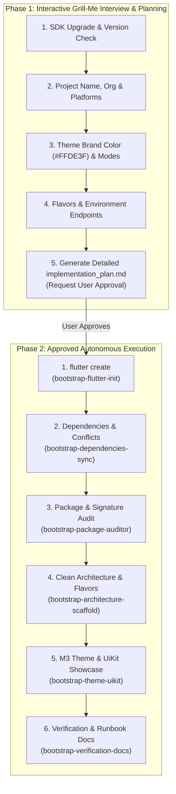

# Project Bootstrap & Scaffolding Coordinator

## 1. Overview & Two-Phase Lifecycle

This skill coordinates the end-to-end initialization and scaffolding of a brand new, production-ready Flutter application adhering strictly to Clean Architecture, Material 3, multi-environment Flavors, and full testability.

To prevent misconfigurations and ensure 100% alignment, the bootstrapping process operates in **two strict phases**:

---

## 2. Phase 1: Interactive Discovery Interview (`grill-me` Protocol)

When the user asks to create/bootstrap a new project (e.g. *"створи новий проект"*, *"bootstrap new flutter app"*, *"ініціалізуй проект з шаблону"*):

The agent **MUST NOT** immediately run modifying commands. Instead, the agent conducts a structured interview using the `ask_question` tool:

1. **Flutter SDK Upgrade:** Check current SDK and ask if user wants to upgrade to latest `stable`.
2. **Project Identity:** Discover project name (snake_case), description, and organization reverse-domain (`--org com.example`).
3. **Target Platforms:** Select platforms (`android`, `ios`, `web`, `macos`, `windows`, `linux`).
4. **Primary Brand Theme:** Confirm `#FFDE3F` or allow custom primary seed color.
5. **Flavors & Environments:** Confirm standard environments (`dev`, `stage`, `prod`) and base URLs.

### Bootstrap Manifest & Implementation Plan Generation
Once all questions are answered, the agent compiles a comprehensive `implementation_plan.md` artifact containing:
- Selected project metadata and exact CLI command to be executed.
- Dependencies list with version locks.
- Layer directory map.
- ColorScheme tokens and `UiKitPage` showcase outline.
- Test and verification plan.

> [!IMPORTANT]
> The agent sets `RequestFeedback: true` on the artifact and **STOPS to wait for explicit user approval** before executing Phase 2.

---

## 3. Phase 2: Execution Sub-Skill Tree & Routing Matrix

Once the user approves the plan, execute the following sub-skills sequentially:

| Step | Target Skill | Purpose & Output |
| :--- | :--- | :--- |
| **1. Flutter Initialization** | [bootstrap-flutter-init](../bootstrap-flutter-init/SKILL.md) | Executing `flutter create` with approved org, name, and platforms. |
| **2. Dependencies & Conflicts** | [bootstrap-dependencies-sync](../bootstrap-dependencies-sync/SKILL.md) | Injecting `pubspec.yaml` packages, running `flutter pub get`, upgrading & tightening constraints. |
| **3. Package Compatibility Audit** | [bootstrap-package-auditor](../bootstrap-package-auditor/SKILL.md) | Running `dart analyze`, applying `dart fix --apply`, checking breaking changes. |
| **4. Architecture & Flavors** | [bootstrap-architecture-scaffold](../bootstrap-architecture-scaffold/SKILL.md) | Scaffolding layer folders, `config/env_*.json`, `AppConfig`, `main.dart`, and `application.dart`. |
| **5. Theme & UiKit Showcase** | [bootstrap-theme-uikit](../bootstrap-theme-uikit/SKILL.md) | Generating M3 theme `#FFDE3F`, injectable `HydratedThemeCubit`, and adaptive `UiKitPage`. |
| **6. Verification & Runbooks** | [bootstrap-verification-docs](../bootstrap-verification-docs/SKILL.md) | Running `build_runner`, executing `flutter test`, and generating `README.md` & `RUNBOOK.md`. |

---

## 4. Global Bootstrapping Laws

1. **Zero Domain Pollution:** All scaffolded template code must use universal, domain-agnostic identifiers (`Item`, `Payload`, `AppConfig`, `ThemeMode`).
2. **Strict Clean Architecture:** Domain contains pure Dart only. Data maps DTOs to Entities. BLoC/Cubit communicates exclusively with Use Cases.
3. **Flavors First-Class:** Every project must support distinct environments (`dev`, `stage`, `prod`) driven by `config/env_*.json` and `--dart-define-from-file`.
4. **Theme Resilience:** Theme primary color `#FFDE3F` must be dynamically applied with Light & Dark ColorSchemes, TextTheme, and `AppCustomColors` ThemeExtension.
5. **Persistence Hygiene:** `ThemeCubit` must use `hydrated_bloc` with serialization extracted into `hydrated_theme_cubit.mixin.dart`.
6. **Automatic Verification:** Code generation, static analysis, and test suites must pass 100% with zero warnings before completion.

---

## 5. Master Bootstrapping Checklist

- [ ] Interactive Grill-Me interview conducted with user.
- [ ] `implementation_plan.md` created and approved by user.
- [ ] Flutter SDK upgraded to latest stable (if requested).
- [ ] `flutter create` executed with explicit `--org` and `--platforms`.
- [ ] Dependencies injected and synchronized in `pubspec.yaml`.
- [ ] Package compatibility audit passed with zero deprecation warnings.
- [ ] Clean Architecture directory structure created with all layer hubs.
- [ ] Flavors configured for Android (`productFlavors`), iOS (Schemes & Build Configurations), and Dart (`AppConfig`).
- [ ] Primary theme `#FFDE3F` generated with Light/Dark support and `ThemeCubit`.
- [ ] Interactive `UiKitPage` created showcasing all design system components.
- [ ] `build_runner` and `intl_utils` code generators executed successfully.
- [ ] All tests passed via `flutter test`.
- [ ] Comprehensive `README.md` and `RUNBOOK.md` documentation generated.
