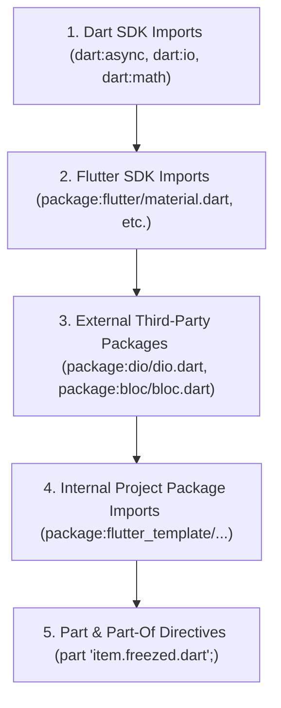

# Dart & Flutter Import Sorter Standard

## 1. Overview & Architectural Role

Consistent, organized import statements eliminate merge conflicts, prevent unused or scattered imports, and make dependencies immediately visible at the top of every file.

`import_sorter` (`import_sorter: ^4.6.0`) automatically sorts and structures imports according to the official Dart style hierarchy:



---

## 2. Prerequisites & Configuration

### 2.1 `pubspec.yaml` Configuration

Ensure `import_sorter` is present in `dev_dependencies` and configured at root:

```yaml
dev_dependencies:
  import_sorter: ^4.6.0

import_sorter:
  comments: false
```

> [!TIP]
> Setting `comments: false` ensures `import_sorter` formats imports cleanly without inserting unnecessary banner comments like `// Dart imports:`, keeping file headers minimal and professional.

---

## 3. Command Line Execution

### Run on Entire Workspace:
```bash
flutter pub run import_sorter:main
```
Or via the Dart CLI:
```bash
dart run import_sorter:main
```

### Run on Specific Files/Directories:
```bash
flutter pub run import_sorter:main lib/presentation/pages/uikit/uikit_page.dart
```

---

## 4. Import Ordering Rules & Hierarchy

When writing or reviewing code, imports MUST strictly adhere to the following order:

```dart
// 1. Dart SDK core libraries
import 'dart:async';
import 'dart:convert';
import 'dart:io';

// 2. Flutter SDK framework libraries
import 'package:flutter/foundation.dart';
import 'package:flutter/material.dart';

// 3. Third-party packages
import 'package:bloc_concurrency/bloc_concurrency.dart';
import 'package:dio/dio.dart';
import 'package:equatable/equatable.dart';
import 'package:flutter_bloc/flutter_bloc.dart';
import 'package:injectable/injectable.dart';

// 4. Project internal package imports (ALWAYS absolute package:...)
import 'package:flutter_template/domain/entities/user_entity.dart';
import 'package:flutter_template/infrastructure/di/injectable.dart';
import 'package:flutter_template/presentation/theme/app_theme.dart';

// 5. Part directives
part 'user_entity.freezed.dart';
part 'user_entity.g.dart';
```

---

## 5. Integration into Development Lifecycle

| Trigger / Workflow | Action | Command |
| :--- | :--- | :--- |
| **New File Creation** | Sort imports immediately after authoring new components | `flutter pub run import_sorter:main <filepath>` |
| **Refactoring / Layer Changes** | Clean up imports across modified layers | `flutter pub run import_sorter:main` |
| **Project Bootstrap** | Run after initial scaffolding and template generation | `flutter pub run import_sorter:main` |
| **Project Adoption** | Sort all legacy imports during adoption pipeline | `flutter pub run import_sorter:main` |
| **Pre-Commit / Static Analysis** | Execute before `dart analyze` to guarantee compliance | `flutter pub run import_sorter:main && dart analyze .` |

---

## 6. Anti-Patterns (Strictly Prohibited)

| Anti-Pattern | Severity | Corrective Action |
| :--- | :--- | :--- |
| Using relative imports (`import '../models/user.dart';`) | **CRITICAL** | ALWAYS use package imports (`import 'package:flutter_template/...';`). |
| Mixing `dart:` and third-party imports arbitrarily | **HIGH** | Run `import_sorter:main` to restore standard grouping. |
| Importing `flutter/material.dart` inside BLoCs or Cubits | **CRITICAL** | Strictly prohibited by `avoid_flutter_imports`. Use domain enums. |
| Skipping import sorting before committing code | **MEDIUM** | Run `flutter pub run import_sorter:main` during CI and pre-commit checks. |

---

## 7. Verification Checklist

- [ ] `import_sorter: ^4.6.0` declared in `dev_dependencies`.
- [ ] `import_sorter: comments: false` configured in `pubspec.yaml`.
- [ ] `flutter pub run import_sorter:main` completes with exit code 0.
- [ ] All imports follow Dart -> Flutter -> 3rd-Party -> Project hierarchy.
- [ ] Zero relative imports outside of `part` / `part of`.
