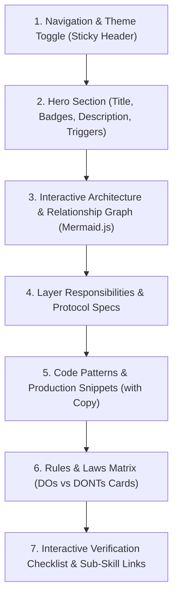

# Skill HTML Documentation Landing Generator

## 1. Overview & Purpose

This skill standardizes the automated generation of premium, interactive, single-page HTML documentation landing pages for any agent skill within the repository.

Every generated HTML page is saved directly alongside the target skill file as:
`.agents/skills/.../<skill-name>/<skill-name>.html`

### Key Architectural Characteristics:
- **100% Self-Contained:** Zero local web server dependencies. Opens directly in any browser (`file://`). Uses lightweight CDN assets (Google Fonts, Mermaid.js, Highlight.js).
- **Consistent Design System:** Standardized typography (Outfit & Inter), dynamic Dark/Light theme toggle with `localStorage` persistence, glassmorphism cards, and accent colors.
- **Interactive Visual Mesh:** Renders architecture and dependency graphs dynamically using Mermaid.js.
- **Developer Experience:** One-click copy buttons for code snippets, interactive verification checklists with dynamic progress bars, and collapsible deep-dive sections.

---

## 2. Universal HTML Landing Architecture & Section Structure

Every generated `<skill-name>.html` MUST include the following 7 core sections in order:



---

## 3. Unified Design System & Styling Tokens

### Color Palette & CSS Variables

All generated HTML pages must embed the following standardized CSS variable palette:

```css
:root {
  --bg-primary: #0b0f19;
  --bg-secondary: #111827;
  --bg-card: rgba(17, 24, 39, 0.7);
  --bg-card-hover: rgba(31, 41, 55, 0.8);
  --border-color: rgba(255, 255, 255, 0.1);
  --border-accent: rgba(255, 222, 63, 0.3);
  
  --brand-primary: #FFDE3F;
  --brand-primary-hover: #FACC15;
  --brand-glow: rgba(255, 222, 63, 0.15);
  
  --text-primary: #F9FAFB;
  --text-secondary: #9CA3AF;
  --text-muted: #6B7280;
  
  --success: #10B981;
  --success-bg: rgba(16, 185, 129, 0.1);
  --error: #EF4444;
  --error-bg: rgba(239, 68, 68, 0.1);
  --warning: #F59E0B;
  --warning-bg: rgba(245, 158, 11, 0.1);
  --info: #3B82F6;
  --info-bg: rgba(59, 130, 246, 0.1);
  
  --radius-sm: 8px;
  --radius-md: 14px;
  --radius-lg: 20px;
  --shadow-card: 0 10px 30px -10px rgba(0, 0, 0, 0.5);
  --font-heading: 'Outfit', sans-serif;
  --font-body: 'Inter', sans-serif;
  --font-mono: 'JetBrains Mono', 'Fira Code', monospace;
}

[data-theme="light"] {
  --bg-primary: #F8FAFC;
  --bg-secondary: #FFFFFF;
  --bg-card: rgba(255, 255, 255, 0.85);
  --bg-card-hover: #FFFFFF;
  --border-color: rgba(0, 0, 0, 0.08);
  --border-accent: rgba(217, 119, 6, 0.3);
  
  --brand-primary: #D97706;
  --brand-primary-hover: #B45309;
  --brand-glow: rgba(217, 119, 6, 0.1);
  
  --text-primary: #0F172A;
  --text-secondary: #475569;
  --text-muted: #94A3B8;
  
  --shadow-card: 0 10px 25px -5px rgba(0, 0, 0, 0.05);
}
```

---

## 4. Step-by-Step Generation Protocol for AI Agents

When requested to create or update HTML documentation for a skill (e.g. *"згенеруй html документацію для скіла <skill-name>"*):

### Step 1: Read & Parse the Target `SKILL.md`
1. Extract frontmatter `name` and `description`.
2. Extract all Mermaid diagrams, code blocks, checklists, DOs/DONTs, and referenced sub-skills.
3. Identify the skill category/layer (`Architecture`, `Domain`, `Data`, `Presentation`, `Native`, `Infrastructure`, `Bootstrap`, etc.).

### Step 2: Build the Self-Contained `<skill-name>.html` File
Construct a complete HTML5 document containing:
- `<head>` with CDN imports: Google Fonts (Outfit, Inter, JetBrains Mono), Highlight.js (CSS + JS), Mermaid.js (`cdn.jsdelivr.net/npm/mermaid/dist/mermaid.min.js`).
- Complete `<style>` block with responsive layouts, CSS variables, glassmorphic cards, syntax theme overrides, and button hover states.
- Sticky navigation bar with Logo, Skill Name, Table of Contents anchors, and Light/Dark toggle button.
- Hero header with trigger keywords pills (`#clean-architecture`, `#bloc`, `#usecase`, etc.) and layer badge.
- Interactive Mermaid container: `<div class="mermaid">...</div>` with dynamic theme detection.
- Content sections matching the target skill's architecture.
- Interactive code blocks with `<button class="copy-btn">Copy</button>`.
- Rules & Laws section with `.rule-card.do` and `.rule-card.dont`.
- Interactive checklist with `<input type="checkbox">` and dynamic percentage progress bar.
- `<script>` tag handling Mermaid initialization, theme toggle, copy button clipboard logic, and checklist state tracking.

### Step 3: Write File to Target Skill Directory
Write the generated HTML to `.agents/skills/.../<target-skill-folder>/<skill-name>.html`.

---

## 5. Standard Interactive JavaScript Components

Every generated landing page must include the following client-side JS logic:

```javascript
// 1. Theme Toggle & Mermaid Re-render
function toggleTheme() {
  const current = document.documentElement.getAttribute('data-theme') || 'dark';
  const next = current === 'dark' ? 'light' : 'dark';
  document.documentElement.setAttribute('data-theme', next);
  localStorage.setItem('skill_doc_theme', next);
  updateThemeIcon(next);
}

// 2. Clipboard Copy
document.querySelectorAll('.copy-btn').forEach(button => {
  button.addEventListener('click', () => {
    const code = button.closest('.code-block-wrapper').querySelector('code').innerText;
    navigator.clipboard.writeText(code).then(() => {
      button.textContent = 'Copied!';
      setTimeout(() => button.textContent = 'Copy', 2000);
    });
  });
});

// 3. Checklist Progress Calculator
function updateProgress() {
  const checkboxes = document.querySelectorAll('.checklist-item input[type="checkbox"]');
  const checked = document.querySelectorAll('.checklist-item input[type="checkbox"]:checked');
  const percent = checkboxes.length ? Math.round((checked.length / checkboxes.length) * 100) : 0;
  document.getElementById('progress-bar').style.width = percent + '%';
  document.getElementById('progress-text').textContent = percent + '% Completed';
}
```

---

## 6. Automated Repository-Wide Generator Script

To generate or regenerate the entire documentation portal, `AGENTS.md` rules, and all 100+ skill landing pages with interconnected hyperlinks and bilingual support:

```bash
dart run .agents/skills/documentation/skill-html-doc-generator/scripts/doc_generator.dart
```

This script automatically:
1. Recursively scans `.agents/skills/` for all `SKILL.md` files and `.agents/AGENTS.md`.
2. Computes the complete cross-reference matrix across all skills.
3. Automatically converts all markdown skill links and bare identifiers into relative hyperlinks.
4. Generates individual `<skill-name>.html` files inside each skill folder.
5. Generates the central search & discovery portal at `.agents/index.html`.
6. Generates `.agents/agents-rules.html` for project architecture rules.

---

## 7. Verification & Quality Gates

Before concluding documentation generation:
- Ensure the page renders without horizontal overflow on both desktop and mobile viewports.
- Validate that all Mermaid syntax parses cleanly.
- Verify that dark/light theme toggle transitions smoothly.
- Verify Ukrainian (🇺🇦 UA) / English (🇬🇧 EN) language toggle functionality.

