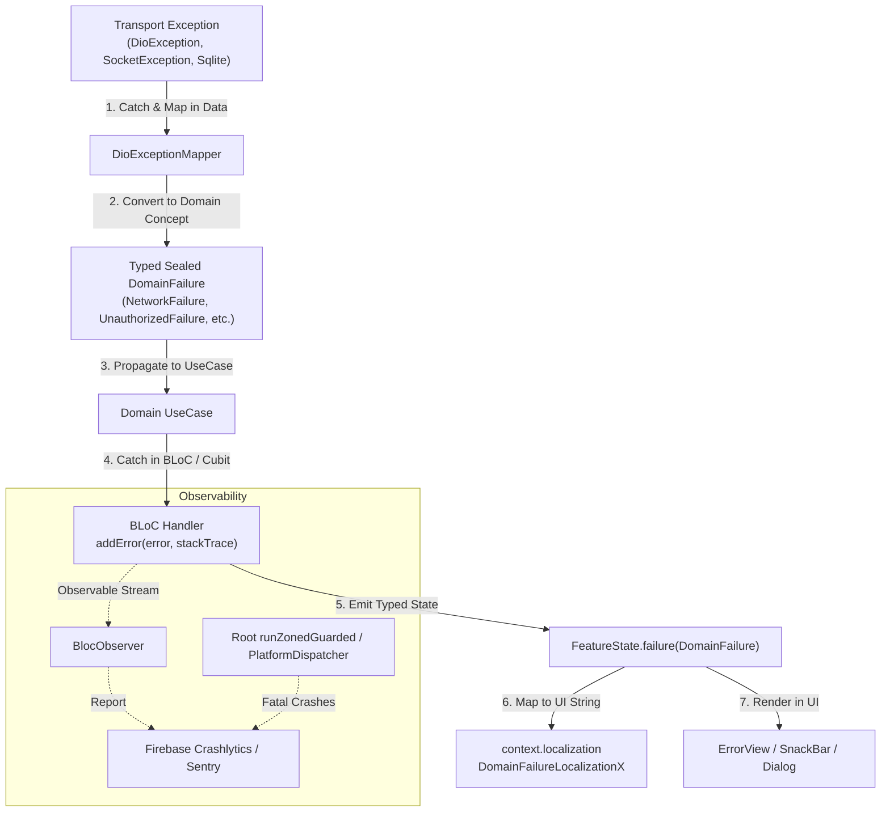

# Error Handling & Resilience Architecture Hub

## 1. Overview & End-to-End Philosophy

In our Clean Architecture Flutter template, error handling is a **cross-cutting discipline**. Errors have a strict, unidirectional lifecycle as they move from low-level transport protocols to Domain business concepts, into BLoC state machines, and finally onto the user's screen or into crash monitoring services.

---

## 2. Error Handling Skill Tree & Routing Matrix

| Focus Area | Target Skill | Purpose |
| :--- | :--- | :--- |
| **Domain Failures** | [domain-failures](../../domain/domain-failures/SKILL.md) | Pure Dart `sealed class DomainFailure` hierarchies, domain invariants, pattern matching. |
| **Data & Transport Mapping** | [error-handling-data-transport](../error-handling-data-transport/SKILL.md) | Capturing `DioException`, HTTP status codes (`401`, `404`, `500`), socket errors via `DioExceptionMapper`. |
| **BLoC & UI Resolution** | [error-handling-bloc-ui](../error-handling-bloc-ui/SKILL.md) | BLoC `try-catch`, `addError` stacktrace preservation, `DomainFailureLocalizationX`, retry flows. |
| **Global Crash Monitoring** | [error-handling-global-crash](../error-handling-global-crash/SKILL.md) | `runZonedGuarded`, `FlutterError.onError`, `PlatformDispatcher.instance.onError`, Crashlytics. |
| **Clean Architecture** | [flutter-clean-architecture](../../flutter-clean-architecture/SKILL.md) | Global system layer boundaries and dependency rules. |
| **Localization Hub** | [l10n-hub](../../l10n/l10n-hub/SKILL.md) | Managing user-facing copy in `.arb` files and `context.localization`. |

---

## 3. Core Architectural Laws of Error Handling

1. **Zero Transport Leakage:**
   - `DioException`, HTTP status codes (`401`, `500`), and raw socket exceptions MUST NEVER escape `lib/data/` or `lib/infrastructure/`.
2. **Pure Domain Failures:**
   - `lib/domain/` operates exclusively with pure Dart `sealed class DomainFailure` models. Domain contains zero UI, Flutter SDK, or transport references.
3. **Preserve Stack Traces (No Silent Catches):**
   - Every `catch (error, stackTrace)` in BLoC event handlers must call `addError(error, stackTrace)` to ensure full observability in crash monitoring tools.
4. **No `e.toString()` in UI:**
   - Strictly **PROHIBITED** to display `e.toString()` or raw exception traces in SnackBars, Dialogs, or Text widgets. All user copy must come from `context.localization` via `DomainFailureLocalizationX`.
5. **Strict `dartz` / `fpdart` Ban:**
   - Functional `Either<L, R>` types are strictly forbidden. Use Dart 3 `sealed class` hierarchies with native pattern matching.
6. **Deterministic State Recovery:**
   - Do NOT automatically clear a `Failure` state back to `Initial` in the same handler. State resets must occur strictly via explicit user actions (e.g. Retry button click).

---

## 4. Master Anti-Patterns (Strictly Prohibited)

| Anti-Pattern | Severity | Corrective Action |
| :--- | :--- | :--- |
| Using `dartz` or `fpdart` (`Either<Failure, T>`, `Left()`, `Right()`) | **CRITICAL** | **STRICTLY PROHIBITED.** Use native Dart 3 `sealed class` hierarchies or typed exceptions. |
| Displaying `e.toString()` in UI widgets or SnackBars | **CRITICAL** | Resolve message via `failure.toLocalizedString(context)` using `context.localization`. |
| Leaking `DioException` or HTTP status checks into BLoCs or UI | **CRITICAL** | Convert transport errors in Data layer Repositories via `DioExceptionMapper`. |
| Swallowing errors in empty `catch (e) {}` blocks | **CRITICAL** | Always log or forward errors via `addError(error, stackTrace)`. |
| Auto-resetting Failure state to Initial in the same event handler | **HIGH** | Keep Failure state until user explicitly dispatches a retry event. |

---

## 5. Master Verification Checklist

- [ ] Data layer maps all `DioException` / transport errors to typed `DomainFailure`.
- [ ] Domain layer defines typed `sealed class DomainFailure` models (pure Dart).
- [ ] BLoC handlers invoke `addError(error, stackTrace)` inside `catch` blocks.
- [ ] UI displays localized messages via `DomainFailureLocalizationX` and `context.localization`.
- [ ] App root in `main.dart` is protected by `runZonedGuarded` and `PlatformDispatcher.instance.onError`.
