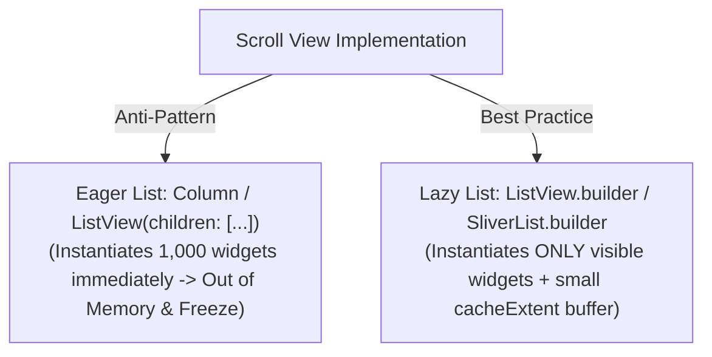

# High-Performance Lists & Slivers Optimization Guide

## 1. Overview & Architectural Role

Scrollable views (lists, grids, feeds) are the primary source of scroll stutter and frame drops if elements are instantiated eagerly or if layout measurements must be recalculated on every scroll delta.

Optimizing scroll performance requires **lazy element instantiation**, **instant scroll offset computation**, and **proper element recycling**.

---

## 2. Lazy Viewport Evaluation vs Eager Lists

Official Flutter Documentation: [ListView Child Elements' Lifecycle](https://api.flutter.dev/flutter/widgets/ListView-class.html#child-elements-lifecycle).



---

## 3. Fixed Extent Optimization (`itemExtent` & `prototypeItem`)

By default, Flutter must lay out every child widget as it approaches the viewport to calculate its height and update the scrollbar position.

Specifying **`itemExtent`** or **`prototypeItem`** allows Flutter to bypass layout measurement entirely, computing scroll positions with simple arithmetic ($O(1)$ complexity):

```dart
// ❌ BAD: Flutter must perform layout measurement on every child item!
ListView.builder(
  itemCount: items.length,
  itemBuilder: (context, index) => ItemCard(item: items[index]),
);

// ✅ GOOD (Fixed Double): Bypasses child layout measurements!
ListView.builder(
  itemCount: items.length,
  itemExtent: 80.0, // Fixed height for every item
  itemBuilder: (context, index) => ItemCard(item: items[index]),
);

// ✅ GOOD (Prototype Widget): Uses a sample item to determine height dynamically
ListView.builder(
  itemCount: items.length,
  prototypeItem: const ItemCard(item: Item.dummy),
  itemBuilder: (context, index) => ItemCard(item: items[index]),
);
```

> [!TIP]
> In Sliver architecture, use `SliverFixedExtentList` or `SliverPrototypeExtentList` instead of generic `SliverList`.

---

## 4. State Preservation & Reordering with `findChildIndexCallback`

When items in a lazy list change order (e.g. user reordering, dynamic sorting, filtering), Flutter might mismatch old `Element` states with new indices, causing flicker or lost form input state.

Provide **`findChildIndexCallback`** so the framework can map Keys directly to their new indices:

```dart
ListView.builder(
  itemCount: items.length,
  findChildIndexCallback: (Key key) {
    final valueKey = key as ValueKey<String>;
    final index = items.indexWhere((item) => item.id == valueKey.value);
    return index != -1 ? index : null;
  },
  itemBuilder: (context, index) {
    final item = items[index];
    return ItemCard(
      key: ValueKey(item.id), // Mandatory Key for element identity
      item: item,
    );
  },
);
```

---

## 5. Child Element Lifecycle & Keep-Alive Tuning

Each list child element has three performance flags inside `SliverChildBuilderDelegate`:

| Parameter | Default | Performance Impact | Recommended Usage |
| :--- | :--- | :--- | :--- |
| **`addAutomaticKeepAlives`** | `true` | Keeps off-screen children alive in memory if they use `AutomaticKeepAliveClientMixin`. | Set `false` for simple read-only feeds to free memory immediately upon scrolling off-screen. |
| **`addRepaintBoundaries`** | `true` | Wraps each child in a `RepaintBoundary`. | Set `false` if children are trivial/simple and rarely repaint independently to save texture memory. |
| **`addSemanticIndexes`** | `true` | Generates accessibility indices for screen readers. | Keep `true` for accessibility compliance. |

```dart
// Optimized list for thousands of lightweight static text items
SliverList(
  delegate: SliverChildBuilderDelegate(
    (context, index) => SimpleTextItem(item: items[index]),
    childCount: items.length,
    addAutomaticKeepAlives: false, // Discard offscreen elements immediately
    addRepaintBoundaries: false,   // Lightweight items do not need isolated GPU layers
  ),
);
```

---

## 6. The `shrinkWrap: true` Anti-Pattern

Wrapping a `ListView` with `shrinkWrap: true` inside another scrollable view causes the inner list to calculate the height of **every single item upfront**, destroying all benefits of lazy evaluation:

```dart
// ❌ CRITICAL ANTI-PATTERN: Destroys lazy loading and causes frame drops!
SingleChildScrollView(
  child: Column(
    children: [
      const HeaderWidget(),
      ListView.builder(
        shrinkWrap: true, // Forces layout of all 500 items!
        physics: const NeverScrollableScrollPhysics(),
        itemCount: items.length,
        itemBuilder: (context, index) => ItemCard(item: items[index]),
      ),
    ],
  ),
);

// ✅ ARCHITECTURAL STANDARD: Slivers-First CustomScrollView
CustomScrollView(
  slivers: [
    const SliverToBoxAdapter(child: HeaderWidget()),
    SliverFixedExtentList(
      itemExtent: 80.0,
      delegate: SliverChildBuilderDelegate(
        (context, index) => ItemCard(item: items[index]),
        childCount: items.length,
      ),
    ),
  ],
);
```

---

## 7. Anti-Patterns (Strictly Prohibited)

| Anti-Pattern | Severity | Corrective Action |
| :--- | :--- | :--- |
| `shrinkWrap: true` on long lists inside `SingleChildScrollView` | **CRITICAL** | Convert to `CustomScrollView` with slivers. |
| Eager `ListView(children: [...])` for collections > 10 items | **CRITICAL** | Use `ListView.builder` or `SliverList.builder`. |
| Omitting `itemExtent` or `prototypeItem` on uniform lists | **HIGH** | Provide `itemExtent` to bypass per-item layout computation. |
| Forgetting `findChildIndexCallback` on dynamic reordering lists | **MEDIUM** | Supply callback with `ValueKey` to preserve state. |

---

## 8. Verification Checklist

- [ ] All scrollable lists use lazy builder constructors (`ListView.builder`, `SliverList.builder`).
- [ ] Uniform height lists specify `itemExtent` or `prototypeItem`.
- [ ] Zero instances of `shrinkWrap: true` nested inside scrollables.
- [ ] Dynamic lists with reordering specify `findChildIndexCallback` and `ValueKey`.
