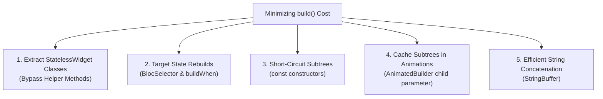

# Flutter Build Phase & Widget Tree Optimization Guide

## 1. Overview & Architectural Role

The `build()` method is invoked frequently during the lifecycle of an application—whenever an ancestor widget rebuilds, media query changes, or state updates.

Optimizing the **Build Phase** ensures the UI thread remains well under **16.6ms** (60 FPS) / **8.3ms** (120 FPS) by eliminating unnecessary computations, short-circuiting widget subtree rebuilds, and caching immutable subtrees.

---

## 2. Core Optimization Techniques



---

## 3. `StatelessWidget` Classes vs Helper Methods

Official Flutter Documentation & YouTube Guideline: [Widgets vs Helper Methods](https://www.youtube.com/watch?v=IOyq-eTRhvo).

### Why Helper Methods (`Widget _buildHeader()`) are an Anti-Pattern:
1. **No Element Lifecycle:** Flutter sees helper methods as part of the parent's single `build()` method. When `setState()` or BLoC emits in the parent, all helper methods are forcibly re-executed.
2. **Cannot Use `const`:** Functions cannot be marked `const`, forcing element allocation on every build frame.
3. **No Granular DevTools Profiling:** Helper methods do not show up as discrete nodes in the Flutter Inspector.

```dart
// ❌ BAD: Re-executes on every parent rebuild and cannot be const!
class BadParentView extends StatelessWidget {
  const BadParentView({super.key});

  @override
  Widget build(BuildContext context) {
    return Column(
      children: [
        _buildHeader(), // Inefficient function call
        _buildBody(),
      ],
    );
  }

  Widget _buildHeader() => const Text('Header');
  Widget _buildBody() => const Text('Body');
}

// ✅ GOOD: Discrete StatelessWidget classes with const constructors!
class GoodParentView extends StatelessWidget {
  const GoodParentView({super.key});

  @override
  Widget build(BuildContext context) {
    return const Column(
      children: [
        HeaderWidget(), // Short-circuits subtree traversal!
        BodyWidget(),
      ],
    );
  }
}

class HeaderWidget extends StatelessWidget {
  const HeaderWidget({super.key});

  @override
  Widget build(BuildContext context) => const Text('Header');
}
```

---

## 4. Rebuild Scope Localization with `BlocSelector`

Do not place `BlocBuilder` high up in the widget hierarchy if only a tiny piece of the UI changes. Use `BlocSelector` or `BlocBuilder.buildWhen` to restrict rebuilds to the exact leaf node:

```dart
// ❌ BAD: Entire dashboard screen rebuilds when only user unread count updates!
BlocBuilder<DashboardBloc, DashboardState>(
  builder: (context, state) {
    return Column(
      children: [
        HeavyAnalyticsChart(data: state.chartData), // Rebuilds unnecessarily!
        UnreadBadge(count: state.unreadCount),
      ],
    );
  },
);

// ✅ GOOD: Only the badge widget rebuilds when unreadCount changes!
class DashboardView extends StatelessWidget {
  const DashboardView({super.key});

  @override
  Widget build(BuildContext context) {
    return Column(
      children: [
        const HeavyAnalyticsChartWrapper(),
        BlocSelector<DashboardBloc, DashboardState, int>(
          selector: (state) => state.unreadCount,
          builder: (context, count) => UnreadBadge(count: count),
        ),
      ],
    );
  }
}
```

---

## 5. `AnimatedBuilder` & `TransitionBuilder` Child Caching

Official Documentation: [AnimatedBuilder Performance Optimizations](https://api.flutter.dev/flutter/widgets/AnimatedBuilder-class.html#performance-optimizations).

If an animation only transforms (rotates, scales, slides, fades) a child widget, pass the child into the `child` parameter of `AnimatedBuilder` rather than constructing it inside the `builder` closure.

```dart
// ❌ BAD: HeavyChildWidget is reconstructed 60/120 times per second!
AnimatedBuilder(
  animation: _controller,
  builder: (context, child) {
    return Transform.rotate(
      angle: _controller.value * 2.0 * math.pi,
      child: const HeavyChildWidget(), // Rebuilt every animation tick!
    );
  },
);

// ✅ GOOD: HeavyChildWidget is built ONCE and passed into the builder closure
AnimatedBuilder(
  animation: _controller,
  child: const HeavyChildWidget(), // Built ONCE
  builder: (context, child) {
    return Transform.rotate(
      angle: _controller.value * 2.0 * math.pi,
      child: child, // Reuses cached instance!
    );
  },
);
```

---

## 6. Efficient String Building with `StringBuffer`

Official Flutter Guideline: [Use StringBuffer](https://docs.flutter.dev/perf/best-practices#use-stringbuffer-for-efficient-string-building).

When building strings inside loops or complex formatting pipelines, avoid repeated string concatenation with `+` which creates intermediate objects in memory:

```dart
// ❌ BAD: Creates new String instances on every iteration
String buildPayload(List<Item> items) {
  String result = '';
  for (final item in items) {
    result += '${item.id}:${item.name},';
  }
  return result;
}

// ✅ GOOD: Collects chunks efficiently in a single buffer
String buildPayload(List<Item> items) {
  final buffer = StringBuffer();
  for (final item in items) {
    buffer.write('${item.id}:${item.name},');
  }
  return buffer.toString();
}
```

---

## 7. Anti-Patterns (Strictly Prohibited)

| Anti-Pattern | Severity | Corrective Action |
| :--- | :--- | :--- |
| Heavy sorting, filtering, or JSON decoding inside `build()` | **CRITICAL** | Offload to background UseCase or `Isolate.run()`. |
| Using helper methods (`Widget _buildSection()`) | **HIGH** | Extract into separate `StatelessWidget` classes. |
| Rebuilding heavy static subtrees inside `AnimatedBuilder` | **HIGH** | Pass static subtrees to the `child` argument. |
| Using root `BlocBuilder` for localized child changes | **HIGH** | Use targeted `BlocSelector` on leaf widgets. |
| Overriding `operator ==` on mutable or complex widgets | **MEDIUM** | Let Flutter's Element tree diffing handle equality naturally. |

---

## 8. Verification Checklist

- [ ] Zero helper builder methods (`Widget _buildX()`) in widget files.
- [ ] Leaf UI components use `BlocSelector` to isolate rebuilds.
- [ ] All `AnimatedBuilder` instances pass static subtrees via the `child` parameter.
- [ ] `const` constructors used across all static widgets and styles.
- [ ] String concatenation in loops uses `StringBuffer`.
