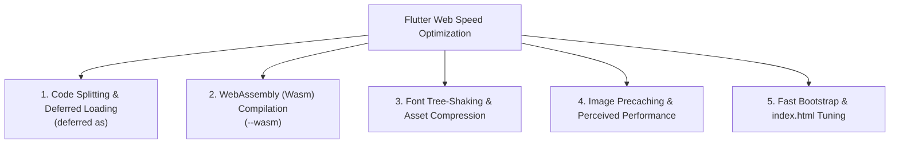

# Flutter Web Loading Speed & Performance Optimization Guide

## 1. Overview & Architectural Role

Official Flutter Engineering Guide: [Best Practices for Optimizing Flutter Web Loading Speed](https://blog.flutter.dev/best-practices-for-optimizing-flutter-web-loading-speed-72643a6d0428).

Flutter Web applications load compiled JavaScript/Wasm bundles, fonts, CanvasKit engine assets, and application data over HTTP. Optimizing for web targets requires reducing the **Initial Bundle Download Size**, **First Contentful Paint (FCP)**, and **Time to Interactive (TTI)**.

---

## 2. Core Pillars of Web Performance



---

## 3. Code Splitting via Deferred Loading (`deferred as`)

Official Guide: [Optimizing Performance with Tree Shaking & Deferred Loading](https://blog.flutter.dev/optimizing-performance-in-flutter-web-apps-with-tree-shaking-and-deferred-loading-535fbe3cd674).

Large features (e.g., admin panels, heavy charts, complex checkout flows) should NOT be downloaded during initial app boot. Use Dart's `deferred as` to load modules on demand:

```dart
// 1. Declare deferred import
import 'package:flutter_template/presentation/pages/analytics/analytics_page.dart' deferred as analytics;

// 2. Load library asynchronously before navigating
class DeferredAnalyticsRouteWrapper extends StatelessWidget {
  const DeferredAnalyticsRouteWrapper({super.key});

  @override
  Widget build(BuildContext context) {
    return FutureBuilder<void>(
      future: analytics.loadLibrary(), // Downloads the JS/Wasm chunk on-demand
      builder: (context, snapshot) {
        if (snapshot.connectionState == ConnectionState.done) {
          return analytics.AnalyticsPage();
        }
        return const Center(child: CircularProgressIndicator());
      },
    );
  }
}
```

---

## 4. WebAssembly (Wasm) & CanvasKit Compilation

Flutter supports compiling Dart directly to **WebAssembly (Wasm)** with the Skwasm rendering engine, yielding up to **2–3x faster execution** and eliminating JIT warm-up jank on supported browsers:

### Production Web Build Commands:

```bash
# WebAssembly (Wasm) Build (Fastest execution, modern browsers)
flutter build web --wasm --release --dart-define-from-file=config/env_prod.json

# Standard CanvasKit / Auto Build (Universal compatibility)
flutter build web --release --dart-define-from-file=config/env_prod.json
```

---

## 5. Image Precaching & Perceived Performance

Official Guide: [Improving Perceived Performance with Image Precaching](https://blog.flutter.dev/improving-perceived-performance-with-image-placeholders-precaching-and-disabled-navigation-6b3601087a2b).

Avoid image popping and layout reflow by precaching critical landing assets during startup or route transitions:

```dart
// Precache hero image in didChangeDependencies() or startup workflow
@override
void didChangeDependencies() {
  super.didChangeDependencies();
  precacheImage(const AssetImage('assets/images/hero_banner.png'), context);
}
```

> [!TIP]
> Use lightweight vector SVG images (`flutter_svg`) or blur placeholders (`blur: ^4.0.2`) while remote network images load.

---

## 6. `index.html` & `flutter.js` Engine Bootstrap Tuning

Customize `web/index.html` to display an immediate, lightweight CSS splash loader while `flutter.js` downloads the engine assets:

```html
<!DOCTYPE html>
<html>
<head>
  <base href="$FLUTTER_BASE_HREF">
  <meta charset="UTF-8">
  <title>App</title>
  
  <!-- Inline CSS Loading Indicator (Zero Network Latency) -->
  <style>
    .loading-container {
      display: flex;
      justify-content: center;
      align-items: center;
      height: 100vh;
      background-color: #0b0f19;
    }
    .spinner {
      width: 48px;
      height: 48px;
      border: 4px solid rgba(255, 222, 63, 0.2);
      border-top-color: #FFDE3F;
      border-radius: 50%;
      animation: spin 1s linear infinite;
    }
    @keyframes spin {
      to { transform: rotate(360deg); }
    }
  </style>
</head>
<body>
  <div id="loading" class="loading-container">
    <div class="spinner"></div>
  </div>

  <script src="flutter.js" defer></script>
  <script>
    window.addEventListener('load', function(ev) {
      _flutter.loader.loadEntrypoint({
        onEntrypointLoaded: async function(engineInitializer) {
          const appRunner = await engineInitializer.initializeEngine();
          // Dismiss HTML splash before running app
          document.getElementById('loading').remove();
          await appRunner.runApp();
        }
      });
    });
  </script>
</body>
</html>
```

---

## 7. Anti-Patterns (Strictly Prohibited)

| Anti-Pattern | Severity | Corrective Action |
| :--- | :--- | :--- |
| Loading large auxiliary screens in main bundle | **HIGH** | Use `deferred as` and `loadLibrary()`. |
| Uncompressed heavy PNG/JPEG assets | **HIGH** | Optimize and compress all raster assets; prefer WebP/SVG. |
| Blocking web render with complex navigation transitions | **MEDIUM** | Use instant or subtle opacity fade transitions on web. |
| Forgetting to remove HTML loading screen in engine callback | **MEDIUM** | Remove loader element in `onEntrypointLoaded`. |

---

## 8. Verification Checklist

- [ ] Heavy secondary features utilize deferred imports (`deferred as`).
- [ ] Critical landing images are precached via `precacheImage()`.
- [ ] `web/index.html` implements smooth inline CSS splash screen.
- [ ] App built and tested with `flutter build web --wasm` or `--release`.
- [ ] Initial bundle size and network waterfall inspected in Chrome DevTools Network panel.
