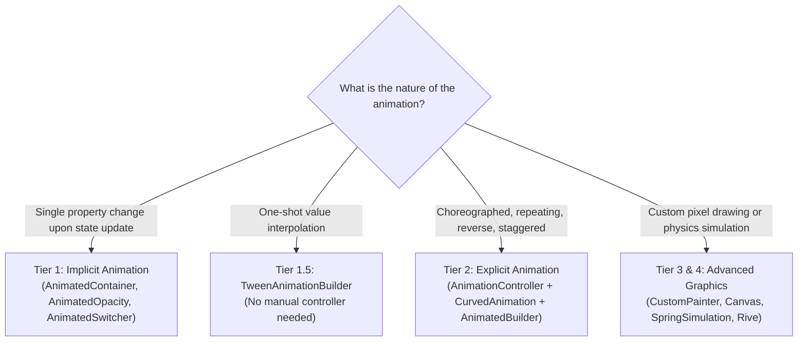

# Flutter Animations: Implicit & Explicit Motion Guide (Tiers 1 & 2)

## 1. Overview & When to Apply

Use this skill whenever:
- Adding smooth, delightful UI transitions and micro-interactions.
- Choosing the right animation mechanism based on the **Animation Complexity Ladder**.
- Implementing **Tier 1 (Implicit)** animations (`AnimatedContainer`, `AnimatedOpacity`, `AnimatedCrossFade`, `AnimatedSwitcher`, `AnimatedPositioned`).
- Implementing **Tier 2 (Explicit)** choreographed animations (`AnimationController`, `CurvedAnimation`, `TweenSequence`, Staggered animations).
- Optimizing frame rates to guarantee 60/120 FPS via static `child` parameter reuse and proper resource disposal.

---

## 2. Prerequisites & Related Skills

| Relation | Skill | Purpose |
| :--- | :--- | :--- |
| **Parent Hub** | [flutter-ui-hub](../flutter-ui-hub/SKILL.md) | Presentation laws and UI routing. |
| **Advanced Motion** | [flutter-ui-advanced-graphics](../flutter-ui-advanced-graphics/SKILL.md) | Tier 3 & 4 (CustomPainter, Shaders, Rive, Physics). |
| **UI Performance** | [flutter-ui-performance](../flutter-ui-performance/SKILL.md) | RepaintBoundary and raster optimization. |
| **Performance Rendering** | [performance-rendering-build](../../performance/performance-rendering-build/SKILL.md) | Child parameter caching and build optimization. |
| **Expensive Operations** | [performance-expensive-operations](../../performance/performance-expensive-operations/SKILL.md) | Opacity anti-patterns, saveLayer, and GPU offscreen buffers. |

---

## 3. The Animation Complexity Ladder



---

## 4. Tier 1: Implicit Animations (Zero Boilerplate)

Use implicit widgets whenever state changes trigger a transition without needing pause, rewind, or loop controls:

### 4.1 AnimatedContainer & AnimatedCrossFade
```dart
import 'package:flutter/material.dart';
import 'package:flutter_template/presentation/ui_utils/extensions/context_extensions.dart';

class ExpandableFilterCard extends StatelessWidget {
  final bool isExpanded;
  final VoidCallback onToggle;

  const ExpandableFilterCard({
    super.key,
    required this.isExpanded,
    required this.onToggle,
  });

  @override
  Widget build(BuildContext context) {
    final colorScheme = context.colorScheme;

    return AnimatedContainer(
      duration: const Duration(milliseconds: 300),
      curve: Curves.easeInOutCubic,
      padding: EdgeInsets.all(isExpanded ? 24.0 : 12.0),
      decoration: BoxDecoration(
        color: isExpanded ? colorScheme.primaryContainer : colorScheme.surface,
        borderRadius: BorderRadius.circular(isExpanded ? 16 : 8),
      ),
      child: InkWell(
        onTap: onToggle,
        child: AnimatedCrossFade(
          duration: const Duration(milliseconds: 250),
          crossFadeState: isExpanded ? CrossFadeState.showSecond : CrossFadeState.showFirst,
          firstChild: const Text('Tap to expand details'),
          secondChild: const Text('Detailed filter options and settings are visible here.'),
        ),
      ),
    );
  }
}
```

---

## 5. Tier 2: Explicit Choreographed Animations

Use `AnimationController` + `AnimatedBuilder` for repeatable, staggered, or controller-driven transitions.

### 5.1 Critical Rule: Reuse the Static `child` Parameter
Always pass heavy subtrees into the `child` argument of `AnimatedBuilder`. This transforms the element on the raster layer without executing the subtree's Dart build method on every frame tick!

```dart
class StaggeredEntranceCard extends StatefulWidget {
  const StaggeredEntranceCard({super.key});

  @override
  State<StaggeredEntranceCard> createState() => _StaggeredEntranceCardState();
}

class _StaggeredEntranceCardState extends State<StaggeredEntranceCard>
    with SingleTickerProviderStateMixin {
  late final AnimationController _controller;
  late final Animation<double> _fadeAnimation;
  late final Animation<Offset> _slideAnimation;

  @override
  void initState() {
    super.initState();
    // 1. Initialize controller
    _controller = AnimationController(
      vsync: this,
      duration: const Duration(milliseconds: 600),
    );

    // 2. Staggered curves (Intervals)
    _fadeAnimation = CurvedAnimation(
      parent: _controller,
      curve: const Interval(0.0, 0.6, curve: Curves.easeOut),
    );

    _slideAnimation = Tween<Offset>(
      begin: const Offset(0.0, 0.2),
      end: Offset.zero,
    ).animate(CurvedAnimation(
      parent: _controller,
      curve: const Interval(0.2, 1.0, curve: Curves.easeOutCubic),
    ));

    _controller.forward();
  }

  @override
  void dispose() {
    // 3. ALWAYS dispose controller to prevent resource leaks
    _controller.dispose();
    super.dispose();
  }

  @override
  Widget build(BuildContext context) {
    // Check accessibility: disable animation if requested by user
    if (MediaQuery.disableAnimationsOf(context)) {
      return const HeavyStaticCardContent();
    }

    return AnimatedBuilder(
      animation: _controller,
      // Pass static subtree into `child` so it is NOT rebuilt on each animation tick!
      child: const HeavyStaticCardContent(),
      builder: (context, child) {
        return FadeTransition(
          opacity: _fadeAnimation,
          child: SlideTransition(
            position: _slideAnimation,
            child: child, // Reused static child
          ),
        );
      },
    );
  }
}
```

---

## 6. Anti-Patterns (Strictly Prohibited)

| Anti-Pattern | Severity | Corrective Action |
| :--- | :--- | :--- |
| Creating `AnimationController` inside the `build()` method | **CRITICAL** | Initialize in `initState()` and call `dispose()` in `dispose()`. |
| Rebuilding heavy subtrees inside `AnimatedBuilder.builder` without using `child` | **HIGH** | Pass the static subtree to `child` parameter and reference it in builder. |
| Using complex `AnimationController` where `AnimatedContainer` suffices | **MEDIUM** | Use Tier 1 Implicit animations for basic state transitions. |
| Ignoring `MediaQuery.disableAnimationsOf(context)` | **MEDIUM** | Check user's accessibility preferences and bypass animations if enabled. |

---

## 7. Verification Checklist

- [ ] `AnimationController` is initialized in `initState` with `SingleTickerProviderStateMixin`.
- [ ] `_controller.dispose()` is unconditionally called in `State.dispose()`.
- [ ] Static subtrees inside `AnimatedBuilder` are passed via the `child` parameter.
- [ ] `MediaQuery.disableAnimationsOf(context)` is respected for accessibility.
- [ ] Implicit animations (`AnimatedContainer`, `AnimatedSwitcher`) are used for simple property transitions.
