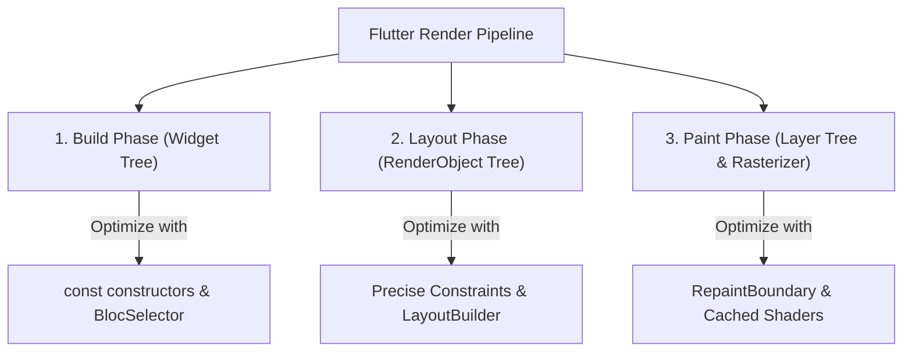

# Flutter UI Rendering Performance & Optimization Guide (60/120 FPS)

## 1. Overview & When to Apply

Use this skill whenever:
- Diagnosing and eliminating UI jank, stutter, or dropped frames (targeting constant 60/120 FPS).
- Optimizing rebuild scopes for complex screens using `BlocSelector` or `ListenableBuilder`.
- Applying `RepaintBoundary` to isolate pixel rasterization from the main layer tree.
- Preventing memory churn by enforcing `const` constructor usage.
- Offloading CPU-heavy data transformations (sorting, large JSON parsing) to worker isolates.

---

## 2. Prerequisites & Related Skills

| Relation | Skill | Purpose |
| :--- | :--- | :--- |
| **Performance Hub** | [performance-hub](../../performance/performance-hub/SKILL.md) | Master performance architecture & DevTools profiling. |
| **Build Optimization** | [performance-rendering-build](../../performance/performance-rendering-build/SKILL.md) | `build()` cost reduction, child caching, and `StatelessWidget`. |
| **Expensive Operations** | [performance-expensive-operations](../../performance/performance-expensive-operations/SKILL.md) | Eliminating `saveLayer()`, `Opacity`, and clipping jank. |
| **Lists & Slivers** | [performance-lists-slivers](../../performance/performance-lists-slivers/SKILL.md) | `itemExtent`, `prototypeItem`, and element recycling. |
| **Parent Hub** | [flutter-ui-hub](../flutter-ui-hub/SKILL.md) | High-level presentation rules and routing. |
| **Animations** | [flutter-ui-animations](../flutter-ui-animations/SKILL.md) | High-performance animation choreography. |
| **Slivers** | [flutter-ui-slivers](../flutter-ui-slivers/SKILL.md) | Lazy scrolling list optimizations. |

---

## 3. Core Pillars of Flutter UI Performance



### 3.1 Rebuild Scope Minimization with `BlocSelector`

Do NOT rebuild an entire page when only a single property changes:

```dart
// ❌ BAD: Rebuilds the whole tree whenever ANY property in HomeState changes!
BlocBuilder<HomeBloc, HomeState>(
  builder: (context, state) {
    return Badge(count: state.unreadNotificationCount);
  },
);

// ✅ GOOD: Rebuilds ONLY when unreadNotificationCount specifically changes!
BlocSelector<HomeBloc, HomeState, int>(
  selector: (state) => state.unreadNotificationCount,
  builder: (context, unreadCount) {
    return NotificationBadge(count: unreadCount);
  },
);
```

### 3.2 Raster Layer Isolation with `RepaintBoundary`

Wrap frequently repainting widgets (e.g. custom visualizers, live counters, complex animations) in `RepaintBoundary` to prevent repainting their parent and sibling widgets:

```dart
class LiveTradingChartWrapper extends StatelessWidget {
  const LiveTradingChartWrapper({super.key});

  @override
  Widget build(BuildContext context) {
    return const RepaintBoundary(
      child: LiveTradingCandlestickChart(),
    );
  }
}
```

### 3.3 List Item Lazy Rendering

Never build unbounded lists inside `SingleChildScrollView` + `Column`. Always use `ListView.builder` or `SliverList.builder` to ensure widgets outside the viewport are not instantiated.

```dart
// ✅ GOOD: Creates elements on-demand as the user scrolls
ListView.builder(
  itemCount: items.length,
  itemExtent: 72.0, // Fixed extent gives instantaneous scroll offset calculations!
  itemBuilder: (context, index) {
    return ItemListTile(item: items[index]);
  },
);
```

---

## 4. Offloading Heavy Work to Background Isolates

Never perform blocking computations inside the UI thread or `build()`:

```dart
// ❌ BAD: Freezes the UI thread during heavy JSON parsing or sorting!
final sortedList = heavySort(rawItems);

// ✅ GOOD: Dispatches heavy CPU task to a worker isolate
final sortedList = await Isolate.run(() => heavySort(rawItems));
```

---

## 5. Performance Anti-Patterns (Strictly Prohibited)

| Anti-Pattern | Severity | Corrective Action |
| :--- | :--- | :--- |
| Heavy computations / parsing inside `build()` | **CRITICAL** | Offload to `Isolate.run()` or UseCase in Domain/Data layer. |
| Instantiating non-const widgets in hot build paths | **HIGH** | Add `const` to all static widgets, EdgeInsets, and TextStyles. |
| Using `BlocBuilder` for whole screens with fine-grained changes | **HIGH** | Decompose and use `BlocSelector` on targeted leaf widgets. |
| `SingleChildScrollView` + `Column` for large datasets | **HIGH** | Replace with `ListView.builder` or `SliverList.builder`. |
| Omitting `itemExtent` or `prototypeItem` on uniform lists | **MEDIUM** | Provide `itemExtent` to bypass per-item layout measurement. |

---

## 6. Performance Audit Checklist

- [ ] All eligible constructors, insets, and borders are annotated with `const`.
- [ ] `BlocSelector` is used instead of broad `BlocBuilder` for leaf state updates.
- [ ] Frequently repainting elements (animations/charts) are isolated with `RepaintBoundary`.
- [ ] Long scrollable lists use lazy builders with known item heights.
- [ ] Heavy sorting or parsing operations run inside `Isolate.run()` or background UseCases.
