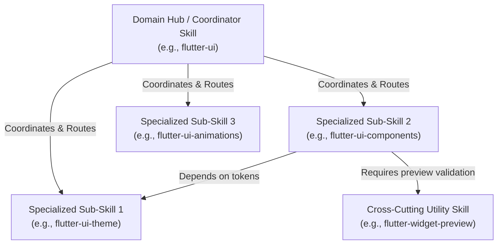

# Antigravity Skill Creator & Standardizer

## 1. Overview & When to Apply

Use this skill whenever:
- Creating a new skill from scratch for Antigravity or a specific codebase.
- Designing a **Skill Tree / Graph / Mesh** for complex domains (e.g., UI, Networking, State Management) with root coordinators and specialized sub-skills.
- Converting complex workflows, architecture guidelines, or API specifications into modular skills.
- Refactoring, modularizing, or interconnecting existing skills with explicit cross-dependencies.
- Auditing skills for progressive disclosure, frontmatter clarity, and actionable instructions.

---

## 2. Skill vs Rule Decision Matrix

Before creating a skill, determine if a **Skill** is the right customization primitive:

| Need | Use Customization | Location |
| :--- | :--- | :--- |
| **Always-on constraints & guidelines** (e.g., response language, strict layer boundaries, banned packages) | **Rule (`AGENTS.md` / `GEMINI.md`)** | Project root or `.agents/rules/` |
| **On-demand workflow, runbook, or specialized domain knowledge** (e.g., Flutter BLoC patterns, Firebase setup, OAuth flow) | **Skill (`SKILL.md`)** | `.agents/skills/<name>/` or `.agents/skills/<domain>/<name>/` |
| **Executable lifecycle hook** (e.g., auto-formatting after edits, pre-commit checks) | **Hook** | `hooks.json` |
| **External tools, protocol servers, or database connections** | **MCP Server** | `mcp_config.json` |

---

## 3. Skill Architecture: Standalone vs Skill Trees & Meshes

Skills should be modular and avoid monolithic bloat. When a domain covers multiple distinct responsibilities, structure skills as a **Hierarchical Tree or Interlinked Mesh**.



### 3.1 Skill Hierarchy Roles

1. **Root / Hub Skill (Coordinator):**
   - Serves as the primary entry point and high-level architectural overview for a domain (e.g., `flutter-ui`, `network-layer`).
   - Outlines domain philosophy, general constraints, and a **Routing Decision Table** pointing to specialized sub-skills.
   - Does NOT contain exhaustive implementation code for every sub-topic.

2. **Specialized Sub-Skill (Child / Leaf):**
   - Deep-dives into a specific sub-domain (e.g., `flutter-ui-theme`, `flutter-ui-responsive`, `flutter-reactive-forms`).
   - Contains concrete code snippets, anti-patterns, and step-by-step implementation recipes.
   - Explicitly references parent or sibling skills for prerequisites.

3. **Cross-Cutting / Utility Skill:**
   - Provides shared workflows or tools utilized across multiple domains (e.g., `flutter-widget-preview`, `dart-run-static-analysis`, `flutter-testing`).

---

## 4. Skill Directory & Folder Organization

### 4.1 Standalone Skill Structure

For single-purpose, self-contained skills:

```text
skills/<skill-name>/
├── SKILL.md            # REQUIRED: Main instruction file with YAML frontmatter
├── scripts/            # OPTIONAL: Executable helper scripts and CLI utilities
├── examples/           # OPTIONAL: Reference implementations and boilerplate code
├── resources/          # OPTIONAL: Configuration templates, JSON schemas, assets
└── references/         # OPTIONAL: Extended manuals and detailed docs (progressive disclosure)
```

### 4.2 Domain-Grouped Skill Tree Structure

When organizing complex domain trees, group related skills under a dedicated domain folder:

```text
skills/<domain>/
├── <domain>-root/                      # Hub / Coordinator skill
│   ├── SKILL.md                        # Entry point, routing table, general domain rules
│   └── references/                     # Architecture diagrams and domain specifications
├── <domain>-<sub-feature-a>/           # Specialized sub-skill A
│   ├── SKILL.md                        # Focused recipes, rules, and code snippets
│   └── examples/                       # Concrete implementation examples
├── <domain>-<sub-feature-b>/           # Specialized sub-skill B
│   └── SKILL.md
└── <domain>-<sub-feature-c>/           # Specialized sub-skill C
    └── SKILL.md
```

*Example: UI Domain Hierarchy:*
```text
skills/ui/
├── flutter-ui-hub/                     # Root UI coordinator & routing
│   └── SKILL.md
├── flutter-ui-theme/                   # Design tokens, ColorScheme, ThemeExtensions
│   └── SKILL.md
├── flutter-ui-components/              # UI Kit widgets, Atomic composition
│   └── SKILL.md
├── flutter-ui-responsive/              # Adaptive layouts, Breakpoints, MediaQuery
│   └── SKILL.md
└── flutter-ui-animations/              # Custom transitions, Rive, AnimationControllers
    └── SKILL.md
```

### 4.3 When to Include Optional Subfolders (`examples/`, `references/`, `scripts/`, `resources/`)

| Subfolder | Primary Purpose | When to Use | When NOT to Use (Keep in `SKILL.md`) |
| :--- | :--- | :--- | :--- |
| **`examples/`** | Full-fledged reference implementations, multi-file code samples, and concrete boilerplate templates. | • Multi-file architectural patterns (e.g., Dio Interceptors + Retry Logic + Domain Mapping, or Hydrated BLoC + Mixin + State).<br/>• Code samples exceeding **50–100 lines** that would bloat `SKILL.md`.<br/>• Standalone `.dart` files that benefit from IDE syntax validation and linting.<br/>• Isolated `good_practice.dart` vs `bad_practice.dart` comparisons. | • Short snippets (**10–30 lines**).<br/>• Simple configuration files.<br/>• Tooling, CLI runbooks, and lint rules (e.g., `import_sorter`, `build_runner`). |
| **`references/`** | Extended domain specs, deep-dive manuals, and architecture notes. | • Exhaustive API specifications, long tables, or complete domain schemas. | • Core architectural rules and primary routing tables needed during standard activation. |
| **`scripts/`** | Executable automation scripts and command helpers. | • Multi-step bash/python automation or code generation validation scripts. | • Single-line CLI commands (embed directly in `SKILL.md`). |
| **`resources/`** | Assets, JSON templates, or base config files. | • Static mock JSON payloads, project config templates, or boilerplate schemas. | • Small config blocks easily displayed as markdown snippets. |

---

## 5. Frontmatter Specifications

The `SKILL.md` MUST start with a YAML frontmatter block:

```yaml
---
name: my-specialized-skill
description: >-
  Concise summary of what the skill does and explicit triggers of when to use it.
  Use third-person phrasing with relevant keywords, file paths, and package names.
---
```

### Frontmatter Rules:
- **`name`** (required): Kebab-case (`[a-z0-9-]+`), concise (≤ 64 characters).
- **`description`** (required): The primary agent reads this description during routing to decide whether to activate the skill. Must clearly specify:
  1. **What** the skill accomplishes.
  2. **When / Trigger conditions** the agent must activate it (e.g., "Use when editing `android/` native code...", "Use when creating BLoC classes...").
  3. **Domain hierarchy context** (if part of a tree, e.g., "Primary entry point for UI architecture. Routes to specialized skills for theming, responsive layouts, and animations.").

---

## 6. Interlinking & Dependency Guidelines for Skill Meshes

To enable seamless navigation across trees and meshes:

1. **Explicit Skill Linking (Mandatory Relative Paths):**
   - ALWAYS link related and dependent skills using **relative markdown links** (e.g., `[Skill Title](../<sub-skill>/SKILL.md)` or `[Root Hub](../<domain>-hub/SKILL.md)`).
   - **STRICTLY PROHIBITED:** Using machine-specific absolute paths (`file:///Users/...` or `C:\...`). Relative paths guarantee 100% portability across different developer machines, operating systems (macOS/Linux/Windows), CI/CD environments, and git clones.
2. **Hub Skill Routing Decision Matrix:**
   - Include a routing table in Hub skills mapping user intent/tasks directly to child skills using relative links.
3. **Prerequisites & Downstream Dependencies:**
   - Child skills must explicitly state upstream dependencies (e.g., "Requires tokens defined in `flutter-ui-theme` before authoring UI components").
4. **Prevent Circular Dependencies & Context Overload:**
   - Do NOT load every child skill simultaneously. Provide clear criteria for when to transition from Hub to Child, or from Child A to Child B.

---

## 7. Core Authoring Principles

1. **Progressive Disclosure & The Router Pattern:**
   - Keep the root `SKILL.md` concise and high-signal (target **≤ 100–150 lines**).
   - When a skill grows "thick" (150+ lines or multiple sub-jobs mixed together), convert `SKILL.md` into a **Job Router**:
     * YAML Frontmatter with exhaustive triggers and keywords.
     * High-level architectural overview and non-negotiable constraints.
     * **Job Routing Table** mapping specific scenarios to targeted files in `references/`, `examples/`, or `resources/`.
     * Explicit agent directive: *"Read ONLY the referenced file matching your current task; do not load everything at once."*
   - Move large reference manuals or exhaustive API docs into `references/` (`./references/doc.md`).
   - Move complete class implementations, multi-file boilerplates, or code templates (>30–50 lines) into `examples/` (`./examples/sample.dart`).
   - Move configuration templates into `resources/` (`./resources/config.json`).
2. **Zero-Loss Rule for Refactoring:**
   - When restructuring thick skills, NEVER change what the skill does or drop any triggers, rules, or architectural invariants. Change ONLY the physical organization.
3. **Zero Redundant Boilerplate:**
   - Focus strictly on project conventions, exact architecture patterns, constraints, and non-obvious nuances.
4. **Actionable Code Examples:**
   - Provide concrete, copy-paste-ready before/after code snippets reflecting production standards. Keep short snippets inline (10–30 lines); offload extensive reference files to `examples/`.
5. **Anti-Patterns & Severity Matrix:**
   - Include a dedicated table listing common mistakes, why they fail, their severity (`CRITICAL`, `HIGH`, `MEDIUM`), and the explicit remedy.
6. **Domain-Agnostic & Abstract Naming Rule (Universal Portability):**
   - ALL code snippets, class names, functions, variables, DTOs, entities, and use cases inside skills MUST use **abstract, domain-agnostic identifiers** (e.g., `[Feature]`, `Item`, `ItemDto`, `ItemEntity`, `User`, `Account`, `Product`, `Resource`, `ExampleItem`) instead of project-specific domain names (e.g., `Movie`, `TMDB`, `CryptoTrade`).
   - This ensures skills remain 100% portable, reusable, and copy-paste ready across any Flutter codebase without domain residue.
7. **Stale Pointer Policy & Router Synchronization:**
   - *A stale pointer is worse than no pointer.* Whenever a file, skill, example, or folder is moved, renamed, or deleted, update the corresponding router table, Hub routing matrix, and relative markdown links within the **same turn**.
   - Every pointer in a router must resolve to an active, valid file path.
8. **Holistic Tree Audit & De-duplication Rule (Trash & Bloat Pruning):**
   - Whenever this skill is invoked to create or modify skills, the AI MUST actively audit the entire `.agents/skills/` tree, verify cross-link integrity, and eliminate redundant or duplicate files.
   - **Single Source of Truth:** Never duplicate the same concept across multiple skill folders (e.g., domain failure definitions belong strictly in `domain-failures`, not duplicated in error handling).
   - **Active Pruning:** Do NOT hesitate to delete obsolete, duplicate, or stale skills (`rm -rf`) to prevent folder bloat and keep the skill repository compact, high-signal, and clean.
   - **Banned Dependencies Enforcement:** Strictly enforce project prohibitions in all generated skill code (e.g., **CRITICAL** ban on `dartz`/`fpdart` `Either`, `provider`, `riverpod`, relative imports, and hardcoded colors).
9. **Agent Verification Checklist:**
   - End with a task-oriented markdown checklist (`- [ ] ...`) allowing the agent to self-verify its work before finishing.

---

## 8. Standard `SKILL.md` Templates

### 8.1 Hub / Coordinator Skill Template

```markdown
---
name: <domain>-hub
description: Primary coordinator and architecture guide for <domain>. Use when designing, reviewing, or organizing <domain> features. Routes to specialized sub-skills for <feature-a>, <feature-b>, and <feature-c>.
---

# <Domain Title> Coordinator & Architecture

## 1. Overview & Domain Scope
- High-level domain responsibilities, core philosophy, and foundational principles.

---

## 2. Skill Tree & Routing Matrix

Use this table to navigate to the specialized sub-skill matching your task:

| Task / Sub-Domain | Target Sub-Skill | Purpose |
| :--- | :--- | :--- |
| <Sub-domain task A> | [<domain>-<sub-a>](../<domain>-<sub-a>/SKILL.md) | <What sub-skill A handles> |
| <Sub-domain task B> | [<domain>-<sub-b>](../<domain>-<sub-b>/SKILL.md) | <What sub-skill B handles> |
| <Sub-domain task C> | [<domain>-<sub-c>](../<domain>-<sub-c>/SKILL.md) | <What sub-skill C handles> |

---

## 3. Global Technical Constraints
- Core constraints applicable across all sub-skills in this domain.

---

## 4. Shared Verification Checklist
- [ ] Domain architectural boundaries respected.
- [ ] Appropriate sub-skills invoked for specialized workflows.
```

### 8.2 Specialized / Leaf Skill Template

```markdown
---
name: <domain>-<sub-feature>
description: <What the skill does and exact triggers/keywords for when to activate it.>
---

# <Sub-Feature Title>

## 1. Overview & When to Apply
- Bullet points defining exact scenarios, target directories, file types, or tasks that trigger this skill.

---

## 2. Prerequisites & Related Skills

| Relation | Skill | When to Consult |
| :--- | :--- | :--- |
| **Parent Hub** | [<domain>-hub](../<domain>-hub/SKILL.md) | For global domain rules and routing |
| **Prerequisite** | [<dependency-skill>](../<dependency-skill>/SKILL.md) | If prerequisite models/tokens are missing |
| **Next Step** | [<downstream-skill>](../<downstream-skill>/SKILL.md) | For validation or testing after implementation |

---

## 3. Technical Constraints & Architecture Rules
- Layer boundaries, banned APIs, strict typing rules, performance requirements, or environment constraints.

---

## 4. Standard Implementation Patterns

### 4.1 Pattern A: <Common Use Case>
\`\`\`dart
// Concrete, clean, production-ready code example
\`\`\`

### 4.2 Pattern B: <Advanced / Edge Case>
\`\`\`dart
// Concrete, clean, production-ready code example
\`\`\`

---

## 5. Workflows & Step-by-Step Instructions

### Step 1: <Action>
...

### Step 2: <Action>
...

---

## 6. Anti-Patterns (Strictly Prohibited)

| Anti-Pattern | Severity | Corrective Action |
| :--- | :--- | :--- |
| <Banned practice / bug> | **CRITICAL** | <Exact fix> |
| <Suboptimal pattern> | **HIGH** | <Exact fix> |

---

## 7. Agent Verification Checklist

When implementing or reviewing code with this skill:
- [ ] Criterion 1 (e.g., layer separation, naming convention)
- [ ] Criterion 2 (e.g., error handling, type safety)
- [ ] Criterion 3 (e.g., tests and validation steps)
```

---

## 9. Step-by-Step Skill Creation & Tree Scaffolding Workflow

### Step 1: Pre-Flight Audit & Duplicate Detection
1. **Search Existing Skills:** Inspect `.agents/skills/` to identify existing skills covering the target domain.
2. **Identify Duplication:** If similar skills exist, decide whether to refactor/extend them or replace them with a modular tree. Avoid creating overlapping duplicate skills!

### Step 2: Scope & Hierarchy Planning
1. Determine if the task needs a **Single Standalone Skill** or a **Skill Tree/Mesh**.
2. If building a tree/mesh:
   - Identify the **Domain Root (Hub)**.
   - List distinct **Sub-Skills (Leaves)** and map inter-dependencies (upstream/downstream).
   - Identify cross-cutting **Utility Skills** needed.

### Step 3: Scaffold Skill Folder Structure
- For Standalone: Create `.agents/skills/<skill-name>/`.
- For Skill Tree: Create domain folder `.agents/skills/<domain>/` with subdirectories for the hub and each child skill.

### Step 4: Author Content with Interlinking
1. Draft YAML frontmatters with clear triggers and hierarchical context.
2. Fill Hub skills with domain routing tables and global constraints.
3. Fill Child skills with actionable recipes, code patterns, and prerequisite links.
4. Establish clear markdown file links between related skills.

### Step 5: Post-Flight De-Duplication, Pruning & Mesh Validation
1. **Prune Stale & Duplicate Files:** Delete old monolithic or redundant skill directories (`rm -rf`) that are superseded by the new tree.
2. **Sync Cross-Links:** Update parent hubs, `flutter-clean-architecture`, and adjacent layer hubs so all relative markdown links point to active, valid files.
3. **Verify Quality Checklist:**
   - [ ] Is the frontmatter `name` kebab-case?
   - [ ] Does the `description` contain clear "Use when..." activation triggers?
   - [ ] Are inter-skill dependencies and routing matrices explicitly documented with clickable markdown links?
   - [ ] Are code examples modern, domain-agnostic, and syntactically valid?
   - [ ] Are project bans (e.g. `dartz`, `fpdart`, hardcoded colors, relative imports) strictly respected?
   - [ ] Is progressive disclosure applied to prevent monolithic skill files?
   - [ ] Zero dead, duplicate, or unlinked skill files remain in `.agents/skills/`.

