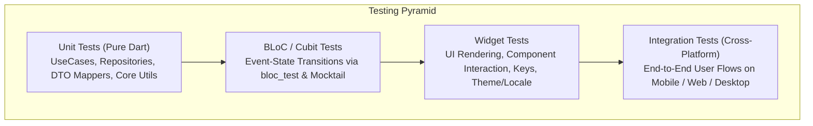

# Testing Strategy & Architecture Hub

## 1. Overview & Testing Pyramid

In our Clean Architecture Flutter template, testing ensures reliability, regression safety, and high code quality across all deployment targets (**Mobile: Android/iOS, Web, Desktop: macOS/Windows/Linux**).



---

## 2. Testing Skill Tree & Routing Matrix

| Level / Focus Area | Target Skill | Purpose |
| :--- | :--- | :--- |
| **Unit Testing** | [testing-unit](../testing-unit/SKILL.md) | Pure Dart testing for UseCases, Repository implementations, DTO mappers, and Core algorithms. |
| **BLoC & Cubit Testing** | [testing-bloc](../testing-bloc/SKILL.md) | State transition verification using `bloc_test`, Mocktail, and async event streams. |
| **Widget Testing** | [testing-widget](../testing-widget/SKILL.md) | Component rendering, `ValueKey` finders, theme/localization wrappers, and pump mechanics. |
| **Integration Testing** | [testing-integration](../testing-integration/SKILL.md) | End-to-end user flows across **Mobile (Android/iOS), Web, and Desktop (macOS/Windows/Linux)**. |
| **Clean Architecture Hub** | [flutter-clean-architecture](../../flutter-clean-architecture/SKILL.md) | System-wide layer separation and dependency rules. |

---

## 3. Core Laws of Testing

1. **Deterministic Isolation:**
   - Tests must never depend on live network connections, actual disk databases, or real platform channel delays.
   - External dependencies must always be mocked using `mocktail` or lightweight in-memory stubs.
2. **GetIt Lifecycle Hygiene:**
   - If `GetIt` is used in widget or integration tests, ALWAYS call `GetIt.I.reset()` in `tearDown()` to avoid state pollution between test cases.
3. **Key-First Finders:**
   - In Widget and Integration tests, locate interactive elements using explicit `ValueKey('identifier')`. Never rely on dynamic localized strings.
4. **Platform Parity:**
   - Integration tests must be runnable across Mobile emulators, headless Chrome for Web, and native Desktop runners with configurable screen viewports.

---

## 4. Test Directory Standard

```text
test/
├── core/                        # Pure Dart unit tests for utils and extensions
│   ├── extensions/
│   └── utils/
├── domain/                      # UseCases and Domain Entity equality tests
│   └── item/
│       └── usecases/
├── data/                        # DTO toDomain mappers & repository tests with mock Dio
│   └── item/
│       ├── dto/
│       └── repositories/
├── presentation/                # BLoC tests and Widget tests
│   ├── state_management/
│   │   └── item/
│   └── pages/
│       └── item/
└── test_utils/                  # Shared test wrappers, fakes, and mock declarations
    ├── widget_test_wrapper.dart
    └── mocks.dart

integration_test/
├── flows/                       # Full end-to-end user journeys
│   ├── auth_flow_test.dart
│   └── item_details_flow_test.dart
└── driver/
    └── integration_test_driver.dart
```

---

## 5. Master Anti-Patterns (Strictly Prohibited)

| Anti-Pattern | Severity | Corrective Action |
| :--- | :--- | :--- |
| Real network requests or live database IO during tests | **CRITICAL** | Inject Mock API clients or Repository mocks in DI. |
| Leaking `GetIt` registrations across test cases | **CRITICAL** | Call `GetIt.I.reset()` in `tearDown()` for every test file. |
| Using `pumpAndSettle()` during infinite spinners | **CRITICAL** | Advance frames using `tester.pump(const Duration(milliseconds: 300))`. |
| Finding target widgets via localized text (`find.text('Submit')`) | **HIGH** | Use explicit `ValueKey('submit_button')`. |
| Using `Future.delayed` or `sleep` in test code | **HIGH** | Use `tester.pump()` or `fakeAsync` clocks. |

---

## 6. Master Verification Checklist

- [ ] Pure Dart unit tests run with `flutter test test/core/ test/domain/ test/data/`.
- [ ] BLoC tests cover all event-to-state transition sequences via `bloc_test`.
- [ ] Widget tests wrap components in `WidgetTestWrapper` with Theme and Localization.
- [ ] Integration tests pass on Mobile, Web (`flutter drive -d chrome`), and Desktop.
- [ ] CI pipeline executes tests with code coverage analysis.
